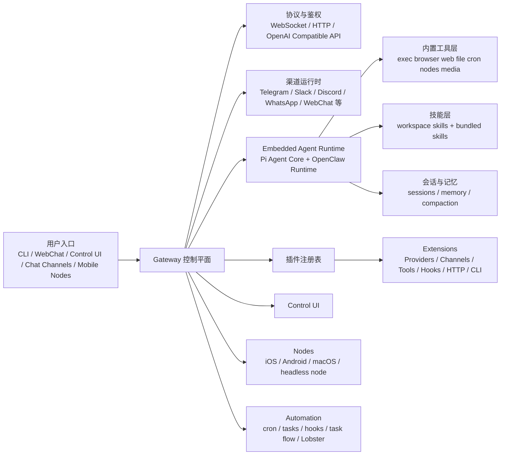

# OpenClaw 开源项目调研报告

## 1. 主仓库确认

本次调研对象最终确认为：[`openclaw/openclaw`](https://github.com/openclaw/openclaw)

选择依据：

- 仓库归属于 `openclaw` 官方同名组织，README、发布、文档、Issue、扩展生态均集中在此。
- 根仓库同时包含核心运行时代码、官方文档、插件扩展、UI、移动端与发布脚本，而非单一镜像或部署包装仓库。
- 其他同名仓库多数是 Docker 镜像、二次封装、教程或衍生生态，不是项目主线源码仓库。

以下分析均基于该主仓库 `main` 分支在 2026-04-28 的公开快照。

---

## 2. 项目概述

OpenClaw 的定位不是单纯的聊天机器人，而是一个“本地优先、自托管、可扩展的 AI Agent 网关运行时”。

其核心目标是：

- 用一个常驻 Gateway 统一连接多种聊天渠道、Web UI、CLI、移动节点与浏览器能力
- 在同一运行时内承载一个或多个 AI Agent
- 让 Agent 可以真正调用工具、执行自动化、管理会话、访问文件、控制浏览器、联动设备与外部模型
- 通过插件、技能、工作流等机制，把平台从“聊天入口”扩展成“可执行的 AI 自动化基础设施”

从官方文档与源码结构看，OpenClaw 是一个以 **Gateway 控制平面 + Embedded Agent Runtime + 插件能力总线 + 多终端接入层** 为核心的系统。

---

## 3. 仓库结构与代码组织

### 3.1 顶层结构

当前主仓库是一个多包仓库，顶层重点目录如下：

```text
openclaw/
├─ src/                 # 核心 TypeScript 运行时
├─ extensions/          # 官方维护的扩展插件集合
├─ skills/              # 内置技能目录
├─ ui/                  # Web Control UI（Vite + Lit）
├─ apps/                # iOS / Android / macOS 原生端
├─ packages/            # plugin-sdk 等共享包
├─ docs/                # 官方文档站内容
├─ scripts/             # 构建、检查、发布、生成脚本
├─ test/                # 测试与夹具
├─ package.json         # 根包与脚本入口
└─ pnpm-workspace.yaml  # 工作区定义
```

补充观察：

- `src/` 当前包含约 64 个一级子目录，是绝对核心代码区。
- `extensions/` 当前包含约 125 个扩展目录，说明插件生态已成为一等架构能力，而不是附属模块。
- `skills/` 当前包含 53 个内置技能目录，表明技能体系是平台默认交付能力之一。
- `pnpm-workspace.yaml` 显示工作区覆盖根包、`ui`、`packages/*`、`extensions/*`，说明仓库采用统一工作区管理模式。

### 3.2 核心源码区分层

`src/` 中最关键的模块可以概括为：

- `cli/`：命令行入口、参数路由、容器/配置/帮助/启动策略
- `gateway/`：Gateway 服务、WebSocket/HTTP、多路复用控制面、鉴权与运行状态
- `agents/`：嵌入式 Agent 运行时、工具注册、会话、子代理、记忆、压缩、策略
- `channels/`：渠道抽象、会话绑定、消息路由与平台无关规则
- `plugins/`：插件发现、清单、注册表、运行时激活、Provider/Channel/Tool 扩展
- `memory/`、`memory-host-sdk/`：记忆与检索相关能力
- `cron/`、`tasks/`、`flows/`：定时任务、后台任务与流式编排
- `web-search/`、`web-fetch/`、`browser/` 等：具体工具或能力域实现

---

## 4. 技术栈与依赖关系

### 4.1 主要技术栈

### 后端与运行时

- TypeScript
- Node.js `>=22.14.0`
- pnpm `10.33.0`
- ESM 模块体系

### 核心库

- `ws`：WebSocket 通信
- `commander`：CLI 框架
- `jiti`：插件运行时按需加载
- `typebox` + `ajv`：协议与配置 Schema 建模、校验
- `zod`：部分运行时结构校验
- `croner`：定时任务调度
- `undici`：HTTP/网络能力
- `openai`：OpenAI 兼容调用面
- `sqlite-vec`：向量检索相关依赖

### Agent 相关依赖

- `@mariozechner/pi-agent-core`
- `@mariozechner/pi-ai`
- `@mariozechner/pi-coding-agent`
- `@mariozechner/pi-tui`
- `@modelcontextprotocol/sdk`
- `@agentclientprotocol/sdk`

### 前端与桌面控制台

- Vite
- Lit
- Vitest
- Playwright
- `markdown-it` / `marked` / `dompurify`

### 原生客户端

- iOS / macOS：Swift 生态
- Android：Gradle / Kotlin 生态

### 4.2 依赖关系判断

从依赖与代码结构可见，OpenClaw 的依赖关系大致是：

1. **Node + TypeScript** 提供统一运行时
2. **Gateway 层** 承接 WebSocket、HTTP、UI、节点接入
3. **Pi Agent Core** 负责模型调用、工具协议与 Agent 执行骨架
4. **OpenClaw 自有层** 在 Pi Core 之上叠加会话、渠道、多代理、插件、审批、自动化与控制平面
5. **插件系统** 继续向外扩展渠道、Provider、媒体、搜索、语音、工作流等能力

这意味着 OpenClaw 不是从零自研 LLM Agent 内核，而是以现成 Agent Core 为底座，重点把工程化的“网关、路由、插件、治理、安全、设备联动”做深做厚。

---

## 5. 架构概览



### 5.1 架构要点

- **Gateway 是单一控制平面**：会话、渠道、HTTP API、WebSocket、UI 与节点都围绕 Gateway 汇聚。
- **Agent Runtime 是执行核心**：模型调用、工具调用、子代理、记忆搜索都在这一层发生。
- **插件注册表是能力总线**：渠道、模型提供商、工具、HTTP 路由、CLI 子命令都可通过插件注册进入系统。
- **多端接入不是附加功能**：Web UI、聊天渠道、移动节点、macOS 菜单栏等都是平台正式入口。
- **自动化是内建能力**：cron、heartbeat、tasks、task flow、Lobster 并列存在，说明项目目标是长期运行的 AI 自动化平台。

---

## 6. 完整功能清单

以下功能均可在官方文档、目录结构或源码模块中得到直接印证。

### 6.1 多渠道消息接入

OpenClaw 支持通过统一 Gateway 接入多种聊天入口。

### 内置或官方支持渠道

- Discord
- Google Chat
- iMessage（legacy）
- IRC
- Signal
- Slack
- Telegram
- WebChat
- WhatsApp

### Bundled Plugin 渠道

- BlueBubbles
- Feishu / Lark
- LINE
- Matrix
- Mattermost
- Microsoft Teams
- Nextcloud Talk
- Nostr
- QQ Bot
- Synology Chat
- Tlon
- Twitch
- Zalo
- Zalo Personal

### 独立插件或外部生态渠道

- Voice Call
- WeChat
- Yuanbao
- 以及更多第三方渠道扩展

### 渠道侧配套能力

- 私聊 / 群聊路由
- mention 激活规则
- allowlist / pairing 安全控制
- 线程与会话绑定
- 状态反应、回执、Typing 生命周期
- 多账号并行接入

### 6.2 Agent 运行时能力

- 单 Gateway 内运行嵌入式 Agent Runtime
- 多 Agent / 多工作区隔离
- 多会话管理
- 流式输出与长回复分块
- 子代理派生与 `sessions_spawn`
- 工具调用结果回放与展示
- 会话压缩与 transcript compaction
- 推理强度与模型策略控制
- Provider 级模型选择与 fallback

### 6.3 工具系统

### 核心内置工具

- `exec` / `process`
- `code_execution`
- `browser`
- `web_search`
- `x_search`
- `web_fetch`
- `read` / `write` / `edit`
- `apply_patch`
- `message`
- `canvas`
- `nodes`
- `cron`
- `gateway`
- `image`
- `image_generate`
- `music_generate`
- `video_generate`
- `tts`
- `sessions_*`
- `subagents`
- `agents_list`
- `session_status`

### 工具治理能力

- `tools.allow` / `tools.deny`
- `tools.profile`（`full` / `coding` / `messaging` / `minimal`）
- Provider 级工具限制
- 审批与授权
- 沙箱模式与路径边界

### 6.4 技能系统

- 工作区技能加载
- 个人技能与共享技能目录
- Bundled skills
- 通过 `SKILL.md` 注入行为约束与使用说明
- 可与工具系统配合使用
- 可由插件携带技能
- 当前主仓库内置 53 个技能目录

### 6.5 插件系统

插件可扩展的能力类型非常完整：

- 模型 Provider
- 渠道 Channel
- Agent Tool
- Speech / TTS / STT
- Realtime Voice
- Realtime Transcription
- Media Understanding
- Image / Music / Video Generation
- Web Search / Web Fetch
- Hook
- HTTP Route
- CLI 子命令
- Gateway RPC
- 后台服务
- Memory Embedding Adapter

并且支持：

- manifest 声明式元数据
- 配置 Schema 校验
- 激活规划与启动时选择性加载
- ClawHub / npm 安装
- Bundled plugin 与 external plugin 并存

### 6.6 模型与 Provider 能力

- 35+ 模型 Provider
- Anthropic、OpenAI、Google 等主流云模型
- Ollama、vLLM、SGLang 等自托管模型
- OpenAI-compatible / Anthropic-compatible 端点
- OAuth 方式订阅鉴权
- Provider 级模型目录、价格、兼容信息与默认值
- Embedding 模型接入

### 6.7 自动化与后台执行

OpenClaw 不是被动问答型产品，自动化模块非常完整：

- Cron 定时任务
- Heartbeat 周期任务
- Tasks 后台任务台账
- Task Flow 多步骤流式编排
- Hooks 事件驱动脚本
- Standing Orders 持久指令
- Lobster 工作流 DSL
- 支持审批暂停与恢复
- 支持 webhook 触发

### 6.8 浏览器与设备联动

### 浏览器能力

- 受控 Chromium/Chrome/Edge/Brave Profile
- 页面导航、点击、截图、表单填写
- Browser login / session profile 隔离
- 可与 Agent 工具直接联动

### Node 设备能力

- iOS / Android / macOS / headless node 接入
- 设备配对与权限控制
- `canvas.*`
- `camera.*`
- `screen.record`
- `location.get`
- `notifications.*`
- `device.*`
- `system.run` / `system.which`
- 节点级 Exec 审批

### 6.9 UI 与交互入口

- CLI
- WebChat
- Web Control UI
- macOS 菜单栏应用
- iOS 节点应用
- Android 节点应用
- 聊天平台入口

### 6.10 API 与兼容层

Gateway 可在同一端口上提供：

- WebSocket 控制协议
- HTTP API
- OpenAI Compatible API：
  - `GET /v1/models`
  - `GET /v1/models/{id}`
  - `POST /v1/embeddings`
  - `POST /v1/chat/completions`
  - `POST /v1/responses`
- `tools/invoke` 类工具调用接口
- Control UI 静态资源与 Hook 接口

### 6.11 安全与治理

- 默认启用 Gateway Auth
- token / password / trusted-proxy / none 多模式
- 非 loopback 暴露时强调鉴权边界
- 共享密钥与 owner 权限模型
- 节点配对与作用域审批
- exec allowlist / approval / full 三类控制
- 工具 allow/deny/profile
- sandbox 路径与宿主机边界保护
- 插件安装安全扫描
- 配置热重载与变更边界管理

---

## 7. 各核心模块职责说明

### 7.1 `src/entry.ts` 与 `src/cli/`

职责：命令入口、快速路径、环境初始化、帮助输出、容器/配置/代理策略。

观察：

- `entry.ts` 负责极薄的入口包装与错误兜底。
- 真实 CLI 调度落在 `cli/run-main.ts`。
- CLI 具有明显的“快路径优化”设计，例如 root help、gateway run、version 处理都尽量避免全量加载。

说明 OpenClaw 对“常驻服务 + 高频 CLI 入口”的启动成本很敏感。

### 7.2 `src/gateway/`

职责：整个系统的控制平面。

关键内容：

- Gateway 启动与生命周期管理
- WebSocket 连接与首帧 `connect` 协议
- HTTP 服务与 API 暴露
- Control UI 路由与静态面
- OpenAI Compatible HTTP 端点
- 鉴权、速率限制、运行时状态与健康检查
- Session 事件、Node 事件、Cron 事件广播
- 插件启动与热重载协作

从 `server.ts` 与 `server.impl.ts` 可以看出，Gateway 服务本身被设计成一个可延迟装载的大模块，以降低入口启动负担。

### 7.3 `src/agents/`

职责：OpenClaw 的 Agent 执行内核与增强层。

核心职责包括：

- 基于 Pi Agent Core 运行模型调用
- 组织工具定义与工具策略
- 读写会话 transcript
- 维护子代理生命周期与会话映射
- 记忆搜索与上下文注入
- 回答分块、reasoning 兼容与压缩
- 工具调用循环检测与结果保护
- host=node / host=gateway 等执行宿主分发

这是 OpenClaw 与通用 LLM SDK 最大的差异化层之一。

### 7.4 `src/channels/`

职责：消息渠道抽象层。

核心内容：

- 账号、会话、线程、sender identity 抽象
- 群聊 / 私聊规则
- allowlist、mention gating、conversation binding
- 回复目标与 thread policy
- 渠道无关的统一消息语义
- `channels/plugins` 下的渠道插件桥接能力

设计特点：

- 核心层更多负责“统一语义与路由规则”
- 具体平台差异尽量下沉到插件与扩展中处理

### 7.5 `src/plugins/`

职责：插件发现、元数据管理、运行时注册、Provider/Channel/Tool 扩展总线。

关键点：

- `discovery.ts`：发现候选插件
- `registry.ts`：创建中心注册表
- `runtime.ts`：维护当前激活插件注册表与表面快照
- manifest、index、install、安全扫描、provider/runtime 相关模块非常完整

官方文档明确把插件系统拆成四层：

1. Manifest + discovery
2. Enablement + validation
3. Runtime loading
4. Surface consumption

这说明插件系统是整个项目的基础设施，而不是简单的“可选扩展”。

### 7.6 `extensions/`

职责：官方维护的能力扩展仓库。

内容覆盖：

- 渠道扩展
- Provider 扩展
- 浏览器、语音、媒体、搜索、记忆等能力扩展
- 工作流、迁移器、诊断工具等配套扩展

当前 `extensions/` 目录规模很大，已经接近“产品能力市场”。很多用户感知到的功能，本质上并不在 `src/` 核心层，而在这里完成注册和实现。

### 7.7 `skills/`

职责：内置技能库。

特点：

- 目录即技能
- 通过 Markdown 指令增强 Agent 行为
- 适合作为“轻量能力封装”，不必写完整插件

它在定位上介于“系统 Prompt 模板”和“可执行插件”之间。

### 7.8 `ui/`

职责：Web Control UI。

技术特征：

- 独立 `package.json`
- Vite 构建
- Lit 组件体系
- 支持测试与浏览器回归

它承担的不是简单聊天窗口，而是：

- 聊天入口
- 配置管理
- 会话查看
- 节点与日志协助
- 运行时控制与运维界面

### 7.9 `apps/`

职责：原生客户端与节点能力载体。

包含：

- `apps/ios`
- `apps/android`
- `apps/macos`
- `apps/shared`

这些目录意味着 OpenClaw 不是“纯服务器项目”，而是把终端节点视为体系结构中的正式成员。

### 7.10 `packages/`

职责：共享开发包与外部 SDK 边界。

可见包包括：

- `plugin-sdk`
- `plugin-package-contract`
- `memory-host-sdk`

说明项目已经把一部分核心扩展能力抽象成可复用、可对外暴露的开发包。

---

## 8. 依赖与模块协作关系

从实现层面看，OpenClaw 的协作链路大致如下：

1. `entry.ts` 启动 CLI
2. CLI 决定是执行一次性命令，还是启动 Gateway
3. Gateway 初始化配置、鉴权、HTTP/WS 服务、插件快照和运行时状态
4. 渠道、UI、Node、API 请求统一进入 Gateway
5. Gateway 根据上下文将请求路由给 Agent Runtime
6. Agent Runtime 结合会话、技能、记忆、工具清单生成执行计划
7. 内置工具或插件工具实际完成调用
8. 结果通过渠道、UI、API 或节点回传
9. tasks / cron / hooks / Lobster 可在后台再次触发新的 Agent 执行

这是一种非常典型的“事件进入控制平面，再路由到可扩展执行平面”的架构。

---

## 9. 实现亮点

### 9.1 单端口多路复用的 Gateway 设计

官方文档显示，OpenClaw 把以下能力尽量放到同一个 Gateway 端口：

- WebSocket 控制协议
- HTTP API
- OpenAI Compatible API
- Control UI
- Hooks / 工具调用入口

好处是部署面简单、心智模型统一、服务边界清晰。

### 9.2 Agent-first 的 OpenAI 兼容层

OpenAI 兼容接口并不是简单代理某个 Provider，而是把 `model` 字段解释为 Agent 目标：

- `openclaw`
- `openclaw/default`
- `openclaw/<agentId>`

这使兼容接口直接接入 OpenClaw 的 Agent 语义，而不是退化成普通模型转发层。

### 9.3 插件元数据快照与激活规划

插件系统并非“扫描目录然后全部 import”。它显式区分：

- manifest 元数据发现
- enablement / validation
- runtime loading
- surface consumption

并引入 metadata snapshot、lookup table、activation planning 等概念，说明项目非常重视：

- 启动性能
- 配置校验前置
- 诊断可解释性
- 运行时按需加载

这是大型插件平台常见但实现成本很高的能力。

### 9.4 共享 `message` 工具模型

在插件架构文档中，渠道插件并不需要各自暴露一套独立发送工具，OpenClaw 保留统一 `message` 工具，插件负责平台特定的发现与执行细节。

这种设计显著降低了 Agent 的工具认知负担，也避免了每种渠道都暴露一组不一致的发送 API。

### 9.5 Agent Runtime 与网关治理分层清晰

OpenClaw 明显把“模型执行”与“平台治理”拆开：

- Pi Agent Core 负责底层 Agent 执行
- OpenClaw 自身负责网关、渠道、鉴权、会话、工具策略、插件、节点和自动化

这种分层有利于项目持续迭代，也降低了底层 Agent 内核替换或增强的成本。

### 9.6 自动化能力不是附属，而是产品主线

仓库中同时存在：

- cron
- tasks
- task flow
- hooks
- heartbeat
- Lobster
- standing orders

这说明 OpenClaw 的目标不是“用户说一句，模型答一句”，而是运行一个持续在线、可审计、可恢复、可编排的 Agent 系统。

### 9.7 节点化设备能力设计

Node 机制把 iOS / Android / macOS / headless host 都纳入统一协议，使设备摄像头、定位、通知、屏幕录制、本地命令执行等能力，能以“受控外设”的方式接入 AI 系统。

这比单纯做一个移动端聊天壳更进一步，体现出平台级思路。

### 9.8 安全边界设计比较完整

从文档与源码命名可以明显看出其安全体系是系统性建设，而不是零散补丁：

- Gateway 鉴权模式
- trusted proxy 模式
- 节点配对
- operator scope
- exec approvals
- allowlist / denylist
- plugin install security scan
- sandbox 与宿主边界
- 插件配置和 manifest 校验

对于一个能执行命令、控制浏览器、连接多聊天渠道、还能开放 OpenAI 兼容 API 的系统来说，这种安全投入是必要且成熟的。

---

## 10. 综合判断

OpenClaw 的本质可以概括为：

**一个面向 AI Agent 的本地优先控制平面与执行平台。**

它并不只做以下某一件事，而是把这些事情整合在一起：

- 多聊天平台 AI 助手
- 自托管 Agent 网关
- 工具执行平台
- 插件生态底座
- 自动化与工作流引擎
- 移动与桌面节点控制系统
- OpenAI 兼容接入层

从代码规模、目录分层、文档完备度和扩展点设计来看，OpenClaw 已经不是一个“单体 AI 应用”，而更像一个围绕 Agent 运行时构建的操作平台。

如果从工程视角评价，其最强的几个特征是：

- 平台化程度高
- 扩展体系完整
- 控制平面思路清晰
- 自动化和设备协同能力突出
- 对安全与治理问题有明确工程应对

如果从风险角度看，其复杂度也明显较高：

- 功能面极广，维护成本高
- 插件、渠道、Provider、节点协作链长
- 高度依赖文档、清单与契约稳定性
- 对启动性能、配置一致性和安全边界要求很高

但正因为如此，OpenClaw 在开源 AI Agent 项目中更接近“可运行平台”而不是“功能演示”。

---

## 11. 调研结论摘要

一句话总结：

**OpenClaw 是一个以 Gateway 为中心、以插件与工具为扩展机制、以多渠道与多终端为入口、以嵌入式 Agent Runtime 为执行核心的自托管 AI Agent 平台。**

它最值得关注的不是单个功能点，而是它把“消息入口、控制平面、Agent 执行、插件生态、自动化工作流、设备联动、安全治理”整合成了一套相互协作的完整工程体系。
