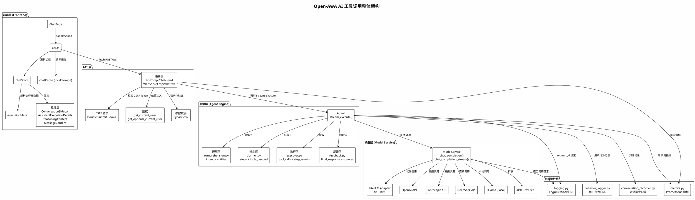
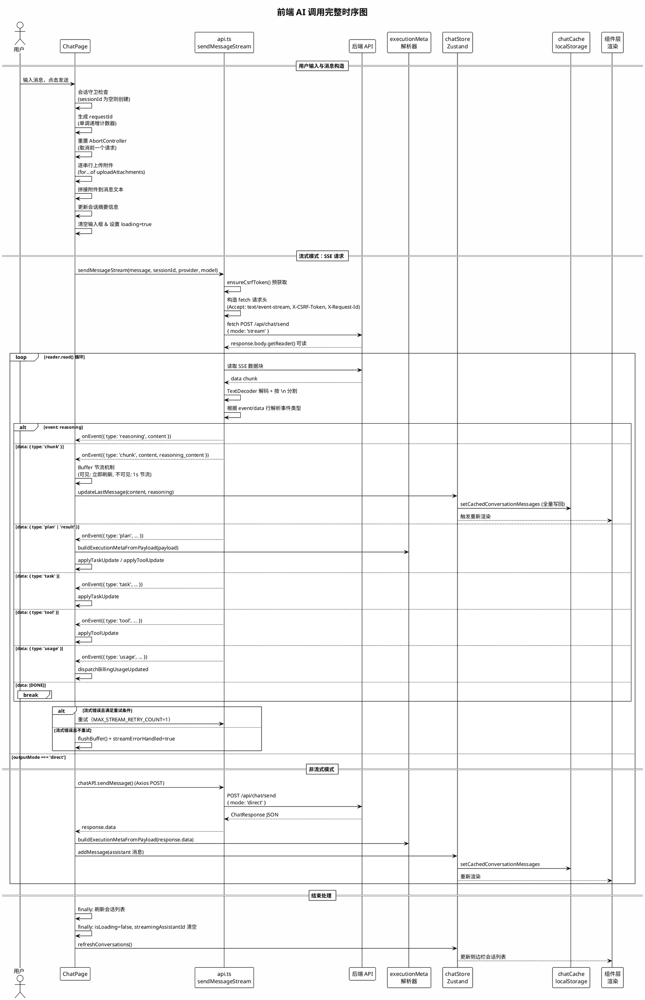
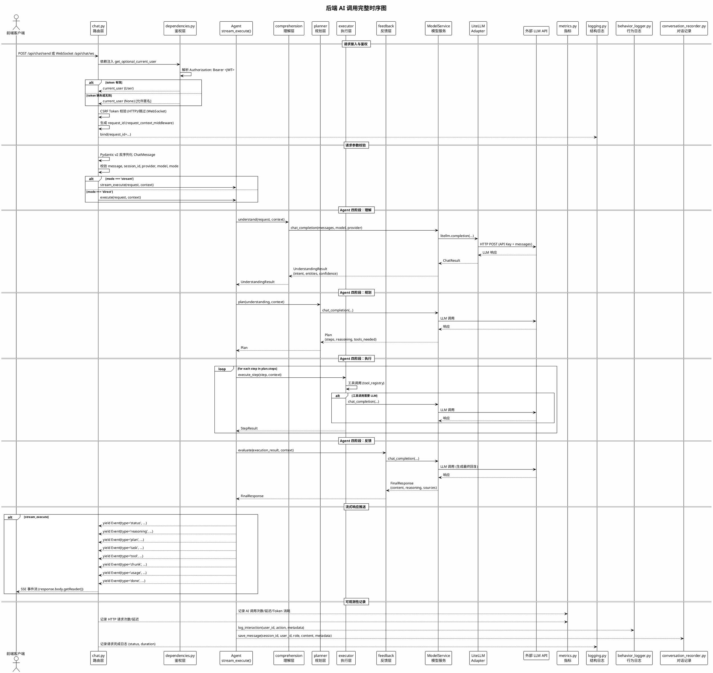

# Open-AwA 内部实现审计报告（含 PlantUML 图表）

> 审计日期：2026-04-24
> 项目路径：`d:\代码\Open-AwA`
> 审计范围：前端 AI 对话调用链路 + 后端 AI 工具调用链路完整实现
> 前端审计涉及文件：14 个核心文件（ChatPage → api.ts → chatStore → executionMeta → chatCache → 组件层）
> 后端审计涉及文件：chat.py → dependencies.py → agent.py → comprehension/planner/executor/feedback → model_service → litellm_adapter → logging/metrics/behavior_logger/conversation_recorder
> 信息来源：前端审计报告 + 后端审计报告

---

## 1. 整体架构图 (PlantUML)

以下 PlantUML 描述了 Open-AwA 的 AI 工具调用整体架构，涵盖前端层、API 层、引擎层、模型层和可观测性层。

---

## 2. 前端链路时序图 (PlantUML)

以下 PlantUML 描述了从用户输入到接口返回的完整前端时序。

---

## 3. 后端链路时序图 (PlantUML)

以下 PlantUML 描述了后端从请求接收到模型推理返回的完整时序。

---

## 4. 接口定义表

### 4.1 前端核心接口

| 函数/接口 | 文件 | 签名/定义 | 说明 |
|-----------|------|----------|------|
| `handleSend` | ChatPage.tsx | `() => Promise<void>` | 消息发送入口，从组件闭包读取状态 |
| `parseSelectedModel` | ChatPage.tsx | `(value: string) => { provider?: string; model?: string }` | 解析 `provider:model` 格式 |
| `sendMessageStream` | api.ts | `(message, sessionId, provider?, model?, onEvent?, onError?, requestOptions?) => Promise<void>` | 流式 SSE 请求，使用原生 fetch |
| `buildExecutionMetaFromPayload` | executionMeta.ts | `(payload: Record<string, any>) => AssistantExecutionMeta` | 从 payload 解析执行元数据 |
| `applyTaskUpdate` | executionMeta.ts | `(meta: AssistantExecutionMeta, task: any) => AssistantExecutionMeta` | 按 step+action 去重合并任务 |
| `applyToolUpdate` | executionMeta.ts | `(meta: AssistantExecutionMeta, tool: any) => AssistantExecutionMeta` | 按 id 去重合并工具事件 |
| `mergeExecutionMeta` | executionMeta.ts | `(base: AssistantExecutionMeta, incoming: AssistantExecutionMeta) => AssistantExecutionMeta` | 深度合并执行元数据 |
| `normalizeUsage` | executionMeta.ts | `(raw: any) => UsageMeta \| undefined` | 规范化用量信息（支持别名） |

### 4.2 前端核心数据结构

| 数据结构 | 字段 | 说明 |
|-----------|------|------|
| `ChatState` | messages, isLoading, sessionId, conversations, outputMode, selectedModel, modelOptions | Zustand store 核心状态 |
| `AssistantExecutionMeta` | intent?, steps, toolEvents, usage? | 执行元数据，包含意图、步骤、工具事件、用量 |
| `ChatCachePayload` | version, activeSessionId, conversations, messageBuckets | localStorage 缓存结构，version=1 |
| `ConversationSessionSummary` | session_id, user_id, title, summary, last_message_preview, message_count | 会话摘要信息 |

### 4.3 后端核心接口

| 函数/接口 | 文件 | 签名/定义 | 说明 |
|-----------|------|----------|------|
| `send_chat` | chat.py | `POST /api/chat/send, response_model=ChatResponse` | 同步聊天 HTTP 端点 |
| `chat_ws` | chat.py | `WebSocket /api/chat/ws` | 流式聊天 WebSocket 端点 |
| `Agent.execute` | agent.py | `async def execute(request, context=None) -> AgentResult` | 同步执行四阶段 |
| `Agent.stream_execute` | agent.py | `async def stream_execute(request, context=None)` | 流式执行，yield 事件 |
| `ModelService.chat_completion` | model_service.py | `async (messages, model, provider?, stream?, **kwargs) -> ChatResult` | 模型调用（非流式） |
| `ModelService.chat_completion_stream` | model_service.py | `async (messages, model, provider?, **kwargs) -> AsyncIterator[StreamChunk]` | 模型调用（流式） |
| `init_logging` | logging.py | `(log_level, service_name, log_serialize, log_dir, log_file_rotation, ...)` | 日志系统初始化 |
| `BehaviorLogger.log_interaction` | behavior_logger.py | `(user_id, action, metadata)` | 用户行为记录 |
| `ConversationRecorder.save_message` | conversation_recorder.py | `(session_id, user_id, role, content, metadata)` | 对话消息持久化 |

### 4.4 后端核心数据结构

| 数据结构 | 字段 | 说明 |
|-----------|------|------|
| `ChatMessage` | message, session_id, provider?, model?, mode? | 聊天请求体 |
| `ChatResponse` | status, response, reasoning_content?, session_id?, error?, request_id? | 聊天响应体 |
| `UnderstandingResult` | intent, entities, context, confidence, requires_clarification | 理解层输出 |
| `Plan` | steps, reasoning, tools_needed | 规划层输出 |
| `ExecutionResult` | step_results, final_output, errors | 执行层输出 |
| `FinalResponse` | content, reasoning_content?, sources, suggestions | 反馈层输出 |

### 4.5 SSE 事件类型定义

| 事件类型 | 方向 | 数据字段 | 说明 |
|---------|------|---------|------|
| `status` | 后端 → 前端 | `content: string` | 阶段状态文本 |
| `chunk` | 后端 → 前端 | `content, reasoning_content` | 流式文本块 |
| `plan` | 后端 → 前端 | `intent, steps` | 规划信息 |
| `task` | 后端 → 前端 | `step, action, status` | 步骤更新 |
| `tool` | 后端 → 前端 | `tool_name, arguments, result` | 工具调用事件 |
| `reasoning` | 后端 → 前端 | `content` | 推理过程 |
| `usage` | 后端 → 前端 | `prompt_tokens, completion_tokens` | Token 用量 |
| `error` | 后端 → 前端 | `message, code` | 错误事件 |
| `done` | 后端 → 前端 | `response, session_id` | 完成事件 |

---

## 5. 超时/重试/缓存/安全策略矩阵

### 5.1 超时策略

| 层级 | 位置 | 当前实现 | 配置值 | 审计意见 |
|------|------|---------|--------|---------|
| **前端 SS E 请求** | api.ts fetch | 未设置超时 | N/A | 长时间无数据推送的流会一直挂起 |
| **前端 AbortController** | ChatPage.tsx | 每次发送前取消前一个请求 | 立即取消 | 实现合理 |
| **后端 HTTP 请求** | model_service.py | httpx.AsyncClient 默认超时 | 5s | 对 LLM 调用偏短，大模型推理可能超时 |
| **后端 Agent 全局超时** | agent.py | 未实现 | N/A | 四阶段串联无整体 timeout，任一阶段阻塞导致请求挂起 (P1) |
| **后端工具调用超时** | executor.py | 未实现 | N/A | 每个工具调用应独立超时控制 (P1) |

### 5.2 重试策略

| 层级 | 位置 | 当前实现 | 重试次数 | 条件 | 审计意见 |
|------|------|---------|---------|------|---------|
| **前端流式** | ChatPage.tsx | 手动重试循环 | MAX_STREAM_RETRY_COUNT=1（最多2次） | 无部分输出 + 网络错误 | 过于保守，长时间流中断无法断点续传 |
| **前端 SSE 连接** | api.ts | 无自动重连 | N/A | N/A | 由调用方处理，sendMessageStream 自身无重试 |
| **后端 LLM 调用** | model_service.py | 未实现 | N/A | N/A | 网络抖动时失败率偏高 (P1) |
| **后端退避策略** | model_service.py | 未实现 | N/A | N/A | 高并发下雪崩风险 (P1) |
| **后端熔断机制** | model_service.py | 未实现 | N/A | N/A | Provider 持续故障时无保护 (P2) |
| **后端 Provider failover** | model_service.py | 未实现 | N/A | N/A | 单点故障、无法自动切换 (P1) |

### 5.3 缓存策略

| 层级 | 位置 | 实现方式 | 限制 | 审计意见 |
|------|------|---------|------|---------|
| **前端消息缓存** | chatCache.ts | localStorage, key=`chat_cache_v1` | MAX_CACHED_MESSAGES=200, MAX_CACHED_CONVERSATIONS=100 | 同步 I/O 频繁写入阻塞主线程 (P1) |
| **前端缓存版本控制** | chatCache.ts | `CHAT_CACHE_VERSION=1`，版本不一致时重置 | N/A | 设计合理，支持自动缓存失效 |
| **前端缓存校验** | chatCache.ts | isValidConversationSummary / isValidSerializedMessage | N/A | 过滤无效条目防止脏数据 |
| **前端模型选择持久化** | chatStore.ts | safeSetItem localStorage | N/A | 仅持久化配置项，合理 |
| **后端对话历史** | conversation_recorder.py | 数据库存储 | 无自动摘要/裁剪 | 长对话占用大量空间 (P2) |
| **后端 CSRF Token** | main.py | 仅当 Cookie 不存在时设置 | 永不过期 | 潜在安全风险 (P3) |

### 5.4 安全策略

| 策略 | 前端实现 | 后端实现 | 审计意见 |
|------|---------|---------|---------|
| **CSRF 防护** | Cookie 读取 + X-CSRF-Token Header | Double Submit Cookie, SameSite=Strict | Cookie `httponly=False`，XSS 下可被窃取 (P1) |
| **CSRF Bootstrap** | GET /auth/me 预获取 token | N/A | 依赖 Cookie 非 HttpOnly，存在兼容性风险 |
| **X-Request-Id** | Axios 拦截器 + fetch 手动注入 | request_context_middleware 生成 | 链路追踪基础，但未透传到 LLM Provider |
| **日志脱敏** | logger.ts 递归脱敏 15+ 敏感字段 | sanitize_for_logging() | 前端 message 字段未脱敏，后端可配置关闭 (P0) |
| **鉴权** | 含 Cookie (withCredentials) | get_optional_current_user 可选 | 匿名用户可无限调用 AI (P0) |
| **JWT 管理** | 由后端控制 | HS256, 24h 过期, 无 refresh token | 过期时间过长 (P2)，无黑名单 (P0) |

---

## 6. 性能瓶颈标注

### 6.1 前端性能瓶颈

| 编号 | 位置 | 问题描述 | 影响等级 | 来源 |
|------|------|---------|---------|------|
| FE-P1 | chatStore.ts | `updateLastMessage` 每次触发完整消息列表写入 localStorage，流式场景高频调用阻塞主线程 | **P0** | 前端报告 |
| FE-P2 | ChatPage.tsx | Buffer 节流机制在页面可见时每次 chunk 都调用 `updateLastMessage`，高频 DOM 更新 | **P1** | 前端报告 |
| FE-P3 | chatStore.ts | `addMessage` 每次写入完整消息列表到 localStorage | **P1** | 前端报告 |
| FE-P4 | ChatPage.tsx | 附件串行上传（for...of），大附件多时用户体验差 | **P1** | 前端报告 |
| FE-P5 | AssistantMarkdownContent.tsx | `react-markdown` + `rehype-highlight` 在超大内容或高频更新时渲染阻塞主线程 | **P1** | 前端报告 |
| FE-P6 | api.ts | SSE 解析 buffer 字符串拼接和 lines 数组切分无大小上限 | **P2** | 前端报告 |
| FE-P7 | backend error report logger.ts | 错误上报队列每次 ERROR 触发 console.error + 序列化 | **P3** | 前端报告 |

### 6.2 后端性能瓶颈

| 编号 | 位置 | 问题描述 | 影响等级 | 来源 |
|------|------|---------|---------|------|
| BE-P1 | agent.py | LLM 调用无全局超时，四阶段串联无 timeout | **P1** | 后端报告 |
| BE-P2 | model_service.py | LLM 调用无自动重试和退避策略 | **P1** | 后端报告 |
| BE-P3 | behavior_logger.py, conversation_recorder.py | 行为日志和对话记录是同步数据库写入 | **P1** | 后端报告 |
| BE-P4 | executor.py | 工具调用结果无大小限制 | **P1** | 后端报告 |
| BE-P5 | model_service.py | Provider 调用失败无 fallback 机制 | **P1** | 后端报告 |
| BE-P6 | model_service.py | 缺少 Provider 健康检查和熔断机制 | **P2** | 后端报告 |
| BE-P7 | model_service.py | 不支持多 API Key 轮换或负载均衡 | **P0** | 后端报告 |
| BE-P8 | model_service.py | 上下文窗口未跟踪管理，超限时直接截断 | **P2** | 后端报告 |
| BE-P9 | model_service.py | 模型路由策略硬编码，不支持动态配置热更新 | **P3** | 后端报告 |
| BE-P10 | agent.py | 四阶段上下文传递无类型约束，使用裸 Dict | **P3** | 后端报告 |

### 6.3 优先级汇总

| 优先级 | 数量 | 核心问题 |
|--------|------|---------|
| **P0** | 2 | FE: localStorage 同步写入阻塞主线程；BE: API Key 不支持轮换 |
| **P1** | 11 | FE: 高频 DOM 更新、全量写回缓存、附件串行上传、Markdown 渲染阻塞；BE: 全局超时、重试策略、同步日志写入、工具结果限制、Provider failover |
| **P2** | 4 | FE: SSE 解析无上限、错误上报开销；BE: 熔断机制、上下文窗口管理 |
| **P3** | 3 | FE: 错误上报开销；BE: 模型路由硬编码、上下文传递类型约束 |

---

## 7. 风险点列表

### 7.1 安全风险

| 编号 | 类别 | 风险描述 | 影响 | 优先级 | 建议修复方案 |
|------|------|---------|------|--------|------------|
| R01 | 资源滥用 | 匿名用户可无限制调用 AI，消耗计算和计费资源 | 计费异常、服务过载 | **P0** | 为匿名用户添加每日配额限制，或要求登录后使用 |
| R02 | Key 管理 | API Key 不支持轮换，单 Key 达到速率限制时无法切换 | 服务不可用 | **P0** | 实现多 Key 池化，支持轮转和负载均衡 |
| R03 | 鉴权 | JWT 无黑名单机制，token 吊销需等 24h 过期 | 权限控制失效 | **P0** | 引入 Redis 黑名单缓存，或缩短 token 过期时间 + 搭配 refresh token |
| R04 | 数据泄露 | 日志脱敏可通过配置关闭（`LOG_DISABLE_SANITIZE=True`），生产环境误用 | 敏感信息泄露 | **P0** | 生产环境强制开启脱敏，通过环境变量锁定配置 |
| R05 | 会话安全 | CSRF Cookie `httponly=False`，XSS 下可被窃取 | 会话劫持 | **P1** | 设置 `httponly=True`，通过 response header 传递 CSRF token |
| R06 | 注入攻击 | 工具调用参数缺少 Schema 校验 | 任意代码执行 | **P1** | 对工具参数实施 JSON Schema 校验，白名单允许字段 |
| R07 | 数据泄露 | 反馈层回复内容未做 PII/敏感信息过滤 | 数据泄露 | **P2** | 回复生成后过敏感信息过滤器（正则/模型） |
| R08 | 输入攻击 | 消息内容无长度限制 | 内存/CPU 攻击向量 | **P2** | 设置 `max_message_length`，拒绝超长请求 |
| R09 | token 管理 | JWT 过期时间 24h 过长 | 泄露窗口过大 | **P2** | 缩短到 1h，引入 refresh token 机制 |
| R10 | 日志安全 | 前端日志 `message` 字段未脱敏 | 敏感信息记录 | **P2** | 在 `message` 字段中也应用脱敏规则 |
| R11 | 传输安全 | 前端 CSRF Token bootstrap 依赖 Cookie 可读性 | 兼容性风险 | **P2** | 服务端通过响应头 `X-CSRF-Token` 同步返回 token |

### 7.2 可靠性与可用性风险

| 编号 | 类别 | 风险描述 | 影响 | 优先级 | 建议修复方案 |
|------|------|---------|------|--------|------------|
| R12 | 超时 | LLM 调用无全局超时，四阶段串联无 timeout | 请求挂起、资源耗尽 | **P1** | 添加 `asyncio.wait_for` 全局超时包装，可配置 timeout 参数 |
| R13 | 重试 | LLM 调用无自动重试和退避策略 | 网络抖动时失败率高 | **P1** | 实现指数退避重试（3 次，初始 1s，最大 10s） |
| R14 | 同步阻塞 | 行为日志和对话记录是同步数据库写入 | 阻塞请求处理 | **P1** | 改为异步写入或消息队列异步落库 |
| R15 | 内存 | 工具调用结果无大小限制 | 内存溢出风险 | **P1** | 对工具结果设置大小上限（如 10MB），超限截断 |
| R16 | 单点 | Provider 调用失败无 fallback 机制 | 单点故障、服务降级 | **P1** | 配置 Provider 优先级列表，主 Provider 失败时自动切换 |
| R17 | 重连 | 前端流式重试策略过于保守（仅 1 次） | 长时间流中断无法恢复 | **P1** | 增加重试次数，支持断点续传（从上次位置继续） |
| R18 | 熔断 | 缺少 Provider 健康检查和熔断机制 | 雪崩风险 | **P2** | 实现熔断器模式（如 pybreaker），连续失败后快速拒绝 |
| R19 | 存储 | 对话记录无自动摘要，数据库空间持续增长 | 存储膨胀 | **P2** | 实现定期摘要任务，对历史对话做自动裁剪 |
| R20 | 速率 | WebSocket 无速率限制 | 资源滥用 | **P2** | 接入限流中间件（如 SlowAPI），匿名用户限制更严 |
| R21 | 缓存 | 前端 localStorage 约 5MB 限制，长对话可能超限 | 缓存数据丢失 | **P2** | 实现 LRU 淘汰策略，或迁移到 IndexedDB |
| R22 | CSRF | CSRF token 永不过期 | 潜在安全风险 | **P3** | 引入 token 生命周期（如 24h 过期） |

### 7.3 可观测性风险

| 编号 | 类别 | 风险描述 | 影响 | 优先级 | 建议修复方案 |
|------|------|---------|------|--------|------------|
| R23 | 指标 | 自定义指标实现简陋（无直方图、无标签） | 无法做 SLA 监控 | **P2** | 引入 `prometheus_client` 标准库，补充 P50/P95/P99 延迟指标 |
| R24 | 追踪 | 不支持 OpenTelemetry，无 trace_id/span_id | 端到端追踪困难 | **P2** | 集成 OpenTelemetry SDK，自动埋点 |
| R25 | 健康 | 健康检查只返回静态 "healthy"，未检测依赖服务 | 健康诊断不准确 | **P3** | 增加数据库、LLM Provider、缓存服务的连接检测 |
| R26 | 追踪 | `request_id` 未透传到 LLM Provider API | 无法在 Provider 侧追踪 | **P3** | 将 request_id 作为 `user` 参数传入 LLM API |

### 7.4 代码质量与维护性风险

| 编号 | 类别 | 风险描述 | 影响 | 优先级 | 建议修复方案 |
|------|------|---------|------|--------|------------|
| R27 | 组件 | ChatPage.tsx 1239 行，handleSend 约 310 行 | 维护困难 | **P1** | 拆分为自定义 hooks（useChatStream、useChatDirect、useChatError） |
| R28 | 类型 | executionMeta.ts 大量 `as Record<string, unknown>` 类型断言 | 运行时错误风险 | **P2** | 引入 Zod 或 io-ts 进行运行时类型校验 |
| R29 | 组件 | ConversationSidebar.tsx 17 个 props 过多 | 可维护性差 | **P2** | 使用 composition 模式拆分，合并相关 props |
| R30 | 类型 | ModelOption 接口定义在 chatStore.ts 而非 types.ts | 类型引用混乱 | **P3** | 统一迁移到 types.ts |
| R31 | 架构 | 各层上下文传递使用裸 Dict，无类型约束 | 运行时错误风险 | **P3** | 定义 TypedDict 或 dataclass，约束字段 |

### 7.5 风险优先级统计

| 优先级 | 数量 | 核心关注领域 |
|--------|------|------------|
| **P0** | 4 | 匿名访问限制、API Key 轮换、JWT 黑名单、日志脱敏配置保护 |
| **P1** | 10 | 超时控制、重试机制、同步写入异步化、工具参数校验、Provider failover、CSRF Cookie 配置、代码拆分 |
| **P2** | 13 | 熔断机制、存储管理、速率限制、缓存策略、PII 过滤、可观测性增强、类型安全 |
| **P3** | 4 | CSRF token 生命周期、模型路由热更新、健康检查增强、上下文传递类型约束 |

---

## 8. 总结与建议

### 8.1 关键发现

1. **架构设计合理但实现粗糙**：Agent 四阶段分离设计（理解-规划-执行-反馈）和前端 Zustand 状态管理框架选择合理，但各层存在超时、重试、熔断等基础能力缺失。
2. **安全风险集中在前端认证和后端 Key 管理**：匿名用户无限制访问、API Key 单点故障、JWT 无黑名单机制是最严重的三个风险。
3. **性能瓶颈集中在同步 I/O 和缺失超时控制**：前端 localStorage 同步写入、后端数据库同步写入、LLM 调用无超时是三大性能短板。
4. **可观测性基础薄弱**：自定义 Prometheus 指标缺少标准能力，不支持 OpenTelemetry，链路追踪不完整。

### 8.2 行动建议

| 阶段 | 行动项 | 目标 |
|------|--------|------|
| **立即 (P0)** | 限制匿名用户配额 / 实现 API Key 轮换 / 添加 JWT 黑名单 / 锁定生产环境脱敏配置 | 消除安全隐患 |
| **短期 (P1)** | 添加全局超时 / 实现重试退避 / 日志异步写入 / 工具参数 Schema 校验 / Provider failover / CSRF Cookie httponly 修复 / ChatPage 代码拆分 | 提升可靠性 |
| **中期 (P2)** | 接入标准 Prometheus 客户端 / 支持 OpenTelemetry / 实现熔断器 / 对话自动摘要 / localStorage LRU 淘汰 / PII 过滤器 / 速率限制 | 完善可观测性和安全 |
| **长期 (P3)** | 动态模型路由 / 健康检查增强 / CSRF token 生命周期管理 / 上下文类型约束 | 提升可维护性 |

### 8.3 架构评分（综合前后端）

| 维度 | 评分 | 说明 |
|------|------|------|
| 架构设计 | 7/10 | 框架选择合理、分层清晰，但实现细节粗糙 |
| 前端代码质量 | 6/10 | ChatPage 组件过大，类型安全不足，缓存策略待优化 |
| 后端代码质量 | 6/10 | 存在大量无实际文档价值的自动生成注释，各层耦合度偏高 |
| 安全性 | 5/10 | 匿名访问、Key 管理、JWT 吊销、CSRF Cookie 配置等关键项待加强 |
| 可观测性 | 4/10 | 自定义指标简陋，不支持 OpenTelemetry |
| 性能 | 5/10 | 同步写入、无超时、无重试、无熔断 |
| 前端用户体验 | 6/10 | 流式渲染基本流畅，但首屏空白、附件上传速度、超大内容渲染等问题存在 |

---

> 本报告基于前端审计报告 (`frontend-ai-calling-pipeline.md`) 和后端审计报告 (`backend-ai-calling-pipeline.md`) 合并生成，覆盖了 Open-AwA 项目完整的 AI 工具调用链路。所有 PlantUML 图表可用 https://www.plantuml.com/ 或本地 PlantUML 渲染器渲染。
