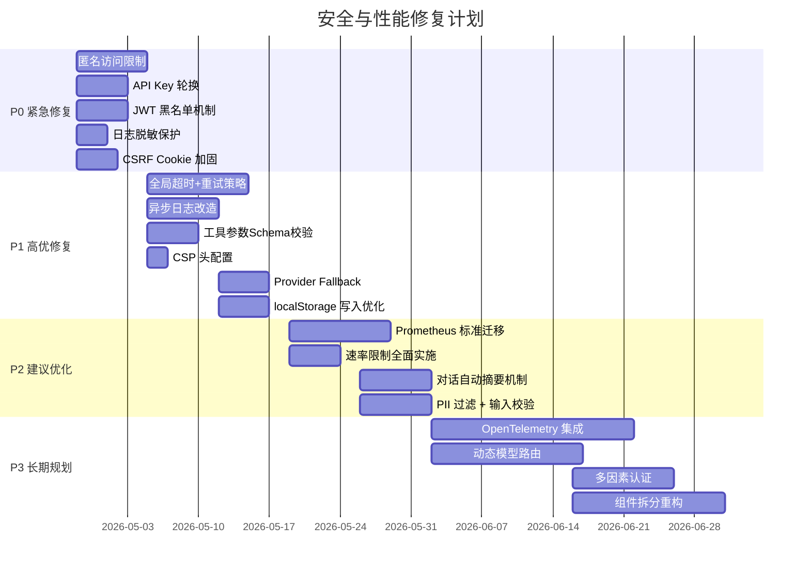

# 安全与性能调优方案文档

> 生成日期：2026-04-24
> 依据文档：
>   - [后端 AI 调用链路审计报告](backend-ai-calling-pipeline.md)
>   - [开源库评估报告](open-source-evaluation.md)
>   - [前端 AI 调用链路审计报告](frontend-ai-calling-pipeline.md)

---

## 1. 性能调优方案

### 1.1 连接池优化

#### 数据库连接池配置（SQLAlchemy）

当前后端使用 SQLAlchemy 异步引擎（`AsyncEngine`），建议对连接池参数进行显式调优：

| 参数 | 建议值 | 说明 |
|------|--------|------|
| `pool_size` | 10-20 | 根据应用并发数调整，默认 5 偏小 |
| `max_overflow` | 10 | 峰值时额外可创建的连接数 |
| `pool_pre_ping` | `True` | 每次连接使用前执行 SELECT 1 检测连接有效性 |
| `pool_recycle` | 3600 | 连接回收时间（秒），避免长时间空闲连接被数据库侧断开 |
| `echo_pool` | `True` (debug) | 仅调试环境开启，用于观察连接池行为 |

配置示例（[main.py](file:///d:/%E4%BB%A3%E7%A0%81/Open-AwA/backend/main.py) 中 `async_engine` 创建处）：

```python
engine = create_async_engine(
    settings.DATABASE_URL,
    pool_size=20,
    max_overflow=10,
    pool_pre_ping=True,
    pool_recycle=3600,
)
```

#### HTTP 客户端连接池配置（httpx）

当前后端主 HTTP 客户端未显式配置连接池限制，建议：

```python
# 在 model_service.py 或其他使用 httpx 的位置
client = httpx.AsyncClient(
    limits=httpx.Limits(
        max_connections=50,          # 最大并发连接数
        max_keepalive_connections=20, # 最大保持连接数
        keepalive_expiry=30.0,       # 保持连接超时（秒）
    ),
    timeout=httpx.Timeout(
        connect=10.0,    # TCP 连接超时
        read=60.0,       # 读取超时（LLM 响应较慢）
        write=10.0,      # 写入超时
        pool=30.0,       # 连接池等待超时
    ),
)
```

#### LiteLLM 连接池配置

LiteLLM 默认使用 `httpx`，建议在初始化时传递自定义客户端：

```python
import litellm

litellm.client = httpx.AsyncClient(
    limits=httpx.Limits(max_connections=30, max_keepalive_connections=15),
    timeout=httpx.Timeout(connect=10.0, read=120.0),
)
```

此外，LiteLLM 应锁定版本并配置每个 provider 的 `max_retries` 和 `timeout`：

```python
# 每个 provider 的精细化配置
litellm.set_verbose = False
litellm.max_retries = 2  # 全局重试次数
litellm.request_timeout = 120  # 全局超时
```

### 1.2 批处理优化

#### 日志批处理写入方案

当前行为日志（[behavior_logger.py](file:///d:/%E4%BB%A3%E7%A0%81/Open-AwA/backend/core/behavior_logger.py)）为同步写入数据库，建议改造为异步批处理：

```python
import asyncio
from collections import deque

class AsyncBatchLogHandler:
    def __init__(self, flush_interval=5.0, batch_size=50):
        self.queue = deque()
        self.flush_interval = flush_interval
        self.batch_size = batch_size
        self._task = None

    async def start(self):
        self._task = asyncio.create_task(self._flush_loop())

    async def stop(self):
        if self._task:
            self._task.cancel()
        await self._flush()  # 最后一批写入

    async def enqueue(self, log_entry: dict):
        self.queue.append(log_entry)
        if len(self.queue) >= self.batch_size:
            await self._flush()

    async def _flush_loop(self):
        while True:
            await asyncio.sleep(self.flush_interval)
            if self.queue:
                await self._flush()

    async def _flush(self):
        batch = list(self.queue)
        self.queue.clear()
        # 批量写入数据库（单条 SQL 插入多条）
        await db.execute(
            insert(behavior_log_table),
            batch
        )
```

迁移路径：
1. 新增 `AsyncBatchLogHandler` 类
2. 替换 `BehaviorLogger.log_interaction` 同步写入为入队操作
3. 在应用启动/关闭时调用 `start()` / `stop()`

#### 会话记录批处理方案

[conversation_recorder.py](file:///d:/%E4%BB%A3%E7%A0%81/Open-AwA/backend/core/conversation_recorder.py) 的 `save_message` 改造方案同上：

```python
class AsyncConversationRecorder:
    def __init__(self):
        self.message_buffer = AsyncBatchLogHandler(flush_interval=3.0, batch_size=30)

    async def save_message(self, session_id, user_id, role, content, metadata):
        if isinstance(content, str) and len(content) > 10000:
            # 超长消息自动摘要后存储
            content = self._summarize_content(content)
        await self.message_buffer.enqueue({
            "session_id": session_id,
            "user_id": user_id,
            "role": role,
            "content": content,
            "metadata": json.dumps(metadata),
            "created_at": datetime.utcnow(),
        })
```

#### 行为日志批处理方案

`get_user_stats` 等统计查询应增加索引和缓存层，而非每次都扫表：

```sql
-- 新增索引
CREATE INDEX idx_behavior_log_user_action ON behavior_log(user_id, action, created_at);
CREATE INDEX idx_behavior_log_tool ON behavior_log(metadata->>'tool_name');
CREATE INDEX idx_behavior_log_intent ON behavior_log(metadata->>'intent');
```

### 1.3 异步优化

#### 现有异步模式评估

| 模块 | 当前模式 | 评估 | 建议 |
|------|---------|------|------|
| `chat.py` 路由 | `async def` | 正确，FastAPI 原生异步 | 无需修改 |
| `agent.py execute()` | 标注 `async`，内部调用 async 方法 | 需确认各阶段是否正确 `await` | 增加类型检查确保无遗漏 |
| `executor.py` 工具调用 | 同步 | **问题**：阻塞事件循环 | 改为 `run_in_executor` 或纯异步 |
| `behavior_logger.py` | 同步 | **问题**：阻塞请求 | 改造为异步批处理（见 1.2） |
| `conversation_recorder.py` | 同步 | **问题**：阻塞请求 | 同上 |

#### 同步转异步的改进点

**工具调用执行器**（[executor.py](file:///d:/%E4%BB%A3%E7%A0%81/Open-AwA/backend/core/executor.py)）：

```python
import asyncio
import functools

class AsyncExecutor:
    async def execute_tool(self, tool_func, *args, **kwargs):
        if asyncio.iscoroutinefunction(tool_func):
            return await tool_func(*args, **kwargs)
        else:
            # 同步工具函数通过线程池执行，避免阻塞事件循环
            loop = asyncio.get_event_loop()
            return await loop.run_in_executor(
                None, functools.partial(tool_func, *args, **kwargs)
            )
```

#### asyncio 使用规范

1. **全局事件循环策略**：设置 `uvloop`（如果可用）作为事件循环策略
2. **Task 创建规范**：所有后台任务使用 `asyncio.create_task()`，并持有引用以便取消
3. **超时统一处理**：所有 `await` 调用应包裹 `asyncio.wait_for()`：

```python
# agent.py 四阶段超时示例
try:
    understanding = await asyncio.wait_for(
        comprehension.understand(request, context),
        timeout=15.0  # 理解阶段最15秒
    )
    plan = await asyncio.wait_for(
        planner.plan(understanding, context),
        timeout=20.0  # 规划阶段最20秒
    )
    # ...
except asyncio.TimeoutError:
    # 返回降级响应
    return AgentResult(
        response="请求处理超时，请简化您的问题后重试。",
        error={"code": "TIMEOUT", "stage": "planning"}
    )
```

### 1.4 缓存策略

#### 多级缓存架构设计

```
用户请求
    |
    v
[浏览器缓存] --> [CDN 缓存] --> [应用层缓存] --> [数据库]
  localStorage     (静态资源)    Redis/Memcached    持久化
```

**前端缓存**：
- **L1**: React 组件级 `useMemo` / `React.memo` 内存缓存
- **L2**: Zustand store 内存状态
- **L3**: localStorage `chatCache`（持久化缓存，有大小和数量限制）

**后端缓存**：
- **L1**: 进程内缓存（`cachetools.TTLCache`），过期时间短
- **L2**: Redis 缓存，存储会话摘要、模型列表、用户配置

#### 缓存淘汰策略

| 层级 | 策略 | 配置 |
|------|------|------|
| localStorage `chatCache` | LRU（最近最少使用） | 最多 100 会话、每会话 200 条消息 |
| Redis | `allkeys-lru` + 过期 TTL | 会话摘要 TTL=1h，模型列表 TTL=5min |
| 进程内缓存 | TTL + 最大条目数 | TTL=60s，maxsize=100 |

建议前端增加缓存过期机制，避免 localStorage 永久占用：

```typescript
// chatCache.ts 增加 TTL 检查
const CACHE_TTL = 7 * 24 * 60 * 60 * 1000; // 7 天

function readChatCache(): ChatCachePayload | null {
  const raw = localStorage.getItem('chat_cache_v1');
  if (!raw) return null;

  const payload = JSON.parse(raw) as ChatCachePayload & { cachedAt?: number };
  if (payload.cachedAt && Date.now() - payload.cachedAt > CACHE_TTL) {
    localStorage.removeItem('chat_cache_v1');
    return null;
  }
  return payload;
}
```

#### 缓存预热方案

| 场景 | 预热策略 | 时机 |
|------|---------|------|
| 模型列表 | 启动时从 DB 加载到 Redis | 应用启动、模型配置变更后 |
| 热门会话 | 按访问频次预加载到 Redis | 用户登录后加载最近 5 个会话 |
| 系统提示词 | 预热到进程缓存 | 应用启动 |

#### 前端缓存优化建议

针对审计报告指出的 [chatStore.ts](file:///d:/%E4%BB%A3%E7%A0%81/Open-AwA/frontend/src/features/chat/store/chatStore.ts) 高频写入问题：

1. **增量更新**：`updateLastMessage` 改为仅更新变化的字段而非全量写回
2. **防抖写入**：流式场景下使用 1-2s 防抖后再写入 localStorage
3. **懒加载**：非活跃会话的消息从 localStorage 延迟卸载
4. **压缩存储**：大消息内容可考虑 `lz-string` 压缩后存储

```typescript
// 优化后的 updateLastMessage 方案
const updateLastMessage = (updater: (msg: ChatMessage) => ChatMessage) => {
  set((state) => {
    const messages = [...state.messages];
    const lastIdx = messages.length - 1;
    if (lastIdx < 0) return state;

    messages[lastIdx] = updater(messages[lastIdx]);

    // 1. 先更新内存状态
    // 2. 防抖写入 localStorage
    debouncedWriteCache(messages);

    return { ...state, messages };
  });
};
```

### 1.5 网络传输优化

#### Gzip 压缩配置

后端 FastAPI 应用应启用 Gzip 中间件（[main.py](file:///d:/%E4%BB%A3%E7%A0%81/Open-AwA/backend/main.py)）：

```python
from fastapi.middleware.gzip import GZipMiddleware

app.add_middleware(
    GZipMiddleware,
    minimum_size=1000,  # 仅压缩大于 1KB 的响应
    compresslevel=5,    # 压缩级别 1-9，平衡速度和压缩率
)
```

#### HTTP/2 支持

FastAPI（Uvicorn）原生支持 HTTP/2，只需调整启动命令：

```bash
# 当前
uvicorn backend.main:app --host 0.0.0.0 --port 8000

# 建议（需要安装 httptools 和 h2）
uvicorn backend.main:app --host 0.0.0.0 --port 8000 --http httptools --ws websockets
```

对于反向代理（nginx），应同时启用 HTTP/2：

```nginx
server {
    listen 443 ssl http2;
    # ...
}
```

#### CDN 缓存策略

| 资源类型 | 缓存策略 | Cache-Control |
|---------|---------|---------------|
| 静态 JS/CSS/Font | 强缓存 + 内容 hash | `public, max-age=31536000, immutable` |
| API 响应 | 不缓存 | `no-cache, no-store, must-revalidate` |
| 模型列表配置 | CDN 缓存 5 分钟 | `public, max-age=300` |
| 用户头像 | CDN 缓存 1 小时 | `public, max-age=3600` |

#### SSE 流式传输优化

针对审计报告提出的 SSE 相关问题：

1. **增加超时保活**：服务端定期发送 `:keepalive\n\n` 注释行，避免反向代理断开空闲连接
2. **前端超时机制**：`sendMessageStream` 增加超时控制：

```typescript
// api.ts sendMessageStream 增加超时
const streamTimeout = 120_000; // 2 分钟
const timeoutId = setTimeout(() => {
  reader.cancel();
  onError?.(new Error('SSE stream timeout after 120s'));
}, streamTimeout);

// 在流结束时/错误时 clearTimeout(timeoutId)
```

3. **断线重连**：前端 SSE 解析器增加 `retry:` 字段支持，或实现指数退避重连
4. **Buffer 大小限制**：SSE 解析的 `buffer` string 超过 1MB 时触发截断警告

---

## 2. 安全加固方案

### 2.1 鉴权加固

#### JWT 黑名单机制

当前 [dependencies.py](file:///d:/%E4%BB%A3%E7%A0%81/Open-AwA/backend/api/dependencies.py) 无 JWT 黑名单机制，token 吊销后仍需等待 24 小时过期。建议引入 Redis 黑名单：

```python
import aioredis
from datetime import datetime, timedelta

class JWTBlacklist:
    def __init__(self, redis_client):
        self.redis = redis_client

    async def revoke(self, jti: str, expires_in: int = 86400):
        """将 JWT ID 加入黑名单，TTL 与原 token 过期时间一致"""
        await self.redis.setex(f"jwt_blacklist:{jti}", expires_in, "1")

    async def is_revoked(self, jti: str) -> bool:
        return await self.redis.exists(f"jwt_blacklist:{jti}")

# 在 token 验证流程中增加黑名单检查
async def get_current_user(token: str = Depends(oauth2_scheme)):
    payload = decode_jwt(token)
    if await jwt_blacklist.is_revoked(payload.get("jti")):
        raise HTTPException(status_code=401, detail="Token has been revoked")
    # ...
```

#### Token 轮换策略

1. **缩短过期时间**：JWT 有效期从 24 小时缩短至 1 小时（`ACCESS_TOKEN_EXPIRE_MINUTES = 60`）
2. **引入 Refresh Token**：Refresh Token 有效期 7 天，存储在数据库中，支持吊销

```python
# 新增 refresh token 端点
@router.post("/auth/refresh")
async def refresh_token(
    refresh_token: str = Body(...),
    db: Session = Depends(get_db),
):
    # 验证 refresh token 是否存在且未被吊销
    stored = db.query(RefreshToken).filter(
        RefreshToken.token == refresh_token,
        RefreshToken.revoked == False,
        RefreshToken.expires_at > datetime.utcnow(),
    ).first()
    if not stored:
        raise HTTPException(status_code=401, detail="Invalid or expired refresh token")

    # 吊销旧 refresh token
    stored.revoked = True

    # 签发新的 access token + refresh token
    new_access = create_access_token(...)
    new_refresh = create_refresh_token(...)
    return {"access_token": new_access, "refresh_token": new_refresh}
```

3. **前端拦截器自动轮换**：Axios 响应拦截器检测 401 时自动调用 `/auth/refresh`

```typescript
// api.ts 拦截器
api.interceptors.response.use(
  (response) => response,
  async (error) => {
    if (error.response?.status === 401 && !error.config._retry) {
      error.config._retry = true;
      const newToken = await refreshAccessToken();
      if (newToken) {
        error.config.headers.Authorization = `Bearer ${newToken}`;
        return api(error.config);
      }
    }
    return Promise.reject(error);
  },
);
```

#### 多因素认证支持

- **P2 建议**：在用户设置中增加 MFA 绑定页面
- **流程**：登录校验账号密码 -> 校验 TOTP/邮箱验证码 -> 签发 JWT
- **推荐库**：`pyotp`（TOTP 生成）+ `qrcode`（绑定二维码）

#### 登录失败锁定

```python
# 登录端点增加失败计数器
LOGIN_MAX_ATTEMPTS = 5
LOGIN_LOCKOUT_MINUTES = 15

@router.post("/auth/login")
async def login(credentials: ..., redis: Redis = Depends(get_redis)):
    ip = request.client.host
    attempts_key = f"login_attempts:{ip}"

    attempts = await redis.get(attempts_key) or 0
    if int(attempts) >= LOGIN_MAX_ATTEMPTS:
        raise HTTPException(
            status_code=429,
            detail=f"登录失败过多，请 {LOGIN_LOCKOUT_MINUTES} 分钟后重试"
        )

    if not verify_password(credentials.password, user.hashed_password):
        await redis.incr(attempts_key)
        await redis.expire(attempts_key, LOGIN_LOCKOUT_MINUTES * 60)
        raise HTTPException(status_code=401, detail="账号或密码错误")

    await redis.delete(attempts_key)  # 登录成功清除计数
    # ...
```

### 2.2 输入校验

#### 参数校验完整性检查

| 检查项 | 当前状态 | 加固方案 |
|--------|---------|---------|
| `ChatMessage.message` 长度 | 无限制 | 增加 `max_length=10000` 约束 |
| `session_id` 格式 | 无校验 | 增加 UUID 格式校验或长度限制（`max_length=64`） |
| `provider` / `model` | 无校验 | 增加白名单校验，防止 SSRF |

```python
class ChatMessage(BaseModel):
    message: str = Field(..., max_length=10000, description="用户消息")
    session_id: Optional[str] = Field(None, max_length=64, pattern=r"^[a-zA-Z0-9_-]+$")
    provider: Optional[str] = Field(None, max_length=50)
    model: Optional[str] = Field(None, max_length=100)
    mode: Optional[str] = Field("stream", pattern=r"^(stream|direct)$")
```

#### SQL 注入防护（已有 ORM 基础上追加）

审计指出 [behavior_logger.py](file:///d:/%E4%BB%A3%E7%A0%81/Open-AwA/backend/core/behavior_logger.py) 的统计查询使用原始 SQL：

```python
# 当前（存在注入风险）
def get_top_tools(self, limit: int):
    query = f"SELECT tool_name, COUNT(*) as cnt FROM behavior_log GROUP BY tool_name ORDER BY cnt DESC LIMIT {limit}"

# 建议（参数化查询）
def get_top_tools(self, limit: int):
    query = text("""
        SELECT metadata->>'tool_name' as tool_name, COUNT(*) as cnt
        FROM behavior_log
        WHERE metadata->>'tool_name' IS NOT NULL
        GROUP BY tool_name ORDER BY cnt DESC LIMIT :limit
    """)
    return db.execute(query, {"limit": limit}).fetchall()
```

所有原始 SQL 必须使用 `text()` + 命名参数绑定，禁止字符串拼接。

#### NoSQL 注入防护

当前后端使用 SQL 数据库，不涉及 NoSQL 注入。未来若引入 MongoDB，需注意：
- 使用 `bson.json_util` 严格序列化
- 禁止直接拼接用户输入到 MongoDB 查询条件
- 使用 `$where` 需特别限制

#### XSS 防护

| 层 | 措施 | 状态 |
|----|------|------|
| 前端 React | 默认转义，无 `dangerouslySetInnerHTML` | 合规 |
| 后端 API | 响应 Content-Type 明确为 `application/json` | 合规 |
| 用户输入回显 | 前端 Markdown 渲染路径经过 `react-markdown` 处理 | 需确认 |
| CSP | 缺少 Content-Security-Policy 头 | **缺失** |

建议前端/后端配置 CSP 头：

```python
# main.py 中间件
@app.middleware("http")
async def add_csp_headers(request: Request, call_next):
    response = await call_next(request)
    response.headers["Content-Security-Policy"] = (
        "default-src 'self'; "
        "script-src 'self'; "
        "style-src 'self' 'unsafe-inline'; "
        "img-src 'self' data: blob:; "
        "connect-src 'self' wss:; "
        "font-src 'self'; "
        "object-src 'none'; "
        "frame-ancestors 'none'"
    )
    return response
```

#### 命令注入防护

[executor.py](file:///d:/%E4%BB%A3%E7%A0%81/Open-AwA/backend/core/executor.py) 的工具调用应遵循：

1. **禁止**直接将模型返回的 tool_call 参数传给 `os.system()`、`subprocess.Popen()` 等
2. 所有 Shell 命令必须使用 `shlex.quote()` 转义参数
3. 工具函数签名使用 Pydantic 模型约束参数类型

```python
from pydantic import BaseModel, Field

class FileReadToolParams(BaseModel):
    file_path: str = Field(..., pattern=r"^[a-zA-Z0-9_/.-]+$")
    encoding: str = Field("utf-8", pattern=r"^(utf-8|utf-16|ascii|latin-1)$")

async def file_read_tool(params: dict) -> str:
    validated = FileReadToolParams(**params)  # 参数校验失败时抛出 ValidationError
    # 安全的文件操作
    ...
```

### 2.3 CSRF/CORS 防护

#### CSRF Token 使用规范

针对审计报告 [main.py](file:///d:/%E4%BB%A3%E7%A0%81/Open-AwA/backend/main.py) 的 CSRF 问题：

1. **设置 `HttpOnly` 副 Cookie**：除前端可读的 CSRF token cookie 外，设置一个 `HttpOnly` 的校验 Cookie，服务端同时验证两者一致性
2. **Token 刷新机制**：每次成功请求后刷新 CSRF token，而非永不过期

```python
# CSRF token 刷新逻辑
def set_csrf_token(response: Response):
    token = secrets.token_urlsafe(32)
    # 前端可读的 token
    response.set_cookie(
        key="csrf_token",
        value=token,
        httponly=False,
        samesite="strict",
        secure=settings.ENVIRONMENT == "production",
    )
    # 服务端验证用的 token（可选，增强）
    response.set_cookie(
        key="csrf_token_server",
        value=hash_token(token),
        httponly=True,
        samesite="strict",
        secure=settings.ENVIRONMENT == "production",
    )
```

3. **CSRF exempt 路径白名单**：维护明确列表，禁止直接对 `/api/*` 全局豁免

#### CORS 白名单配置

当前 CORS 配置若为 `allow_origins=["*"]` 应严格限定：

```python
app.add_middleware(
    CORSMiddleware,
    allow_origins=settings.ALLOWED_ORIGINS,  # 生产环境为具体域名列表
    allow_credentials=True,
    allow_methods=["GET", "POST", "PUT", "DELETE", "PATCH", "OPTIONS"],
    allow_headers=["*"],
    expose_headers=["X-Request-ID", "X-CSRF-Token"],
)
```

#### Cookie Security 标志

```python
# 所有 Cookie 设置确保以下标志
response.set_cookie(
    ...,
    secure=True,          # 仅 HTTPS 传输（生产环境）
    httponly=False,       # CSRF token cookie 需要前端可读
    samesite="strict",    # 防止跨站请求携带
)
```

### 2.4 速率限制

#### 全局限流策略

在 FastAPI 中集成速率限制中间件：

```python
from slowapi import Limiter, _rate_limit_exceeded_handler
from slowapi.util import get_remote_address

limiter = Limiter(key_func=get_remote_address)
app.state.limiter = limiter
app.add_exception_handler(429, _rate_limit_exceeded_handler)

# 默认全局限流
@app.get("/api/chat/send")
@limiter.limit("30/minute")
async def send_chat(...):
    ...
```

#### 基于用户/API Key 的限流

```python
# 按用户 ID 限流
def get_user_key(request: Request) -> str:
    user = getattr(request.state, "current_user", None)
    if user:
        return f"user:{user.id}"
    return get_remote_address(request)

limiter = Limiter(key_func=get_user_key)

# 不同等级用户不同限制
@router.post("/chat/send")
@limiter.limit("60/minute")  # 已登录用户
# 匿名用户通过独立的端点或中间件限制为 5/minute
```

#### 基于 IP 的限流

```python
# IP 限流配合 Redis 实现分布式
from aioredis import Redis

class IPRateLimiter:
    def __init__(self, redis: Redis):
        self.redis = redis

    async def check(self, ip: str, max_requests: int = 100, window: int = 60) -> bool:
        key = f"ratelimit:ip:{ip}"
        current = await self.redis.incr(key)
        if current == 1:
            await self.redis.expire(key, window)
        return current <= max_requests
```

#### 突发流量处理

1. **令牌桶算法**：基于 Redis 的令牌桶，允许短时突发但长期平均受限
2. **队列削峰**：LLM 调用请求先入队列，异步处理，排队时返回 `202 Accepted`
3. **降级响应**：超出容量时自动切换为非流式模式，减轻服务端压力

### 2.5 沙箱隔离

#### 插件沙箱加固建议

审计报告提及 Dify 插件存在高危安全漏洞，建议：

1. **插件运行隔离**：使用 `nsjail`（Linux）或 Docker 容器运行第三方插件
2. **文件系统限制**：插件只能访问 `/tmp/plugins/<plugin_id>/` 目录
3. **网络限制**：默认禁用网络，按需白名单授权
4. **资源限制**：CPU 1 核、内存 256MB、运行时间 30s

#### 代码执行沙箱建议

对于需要动态执行用户代码的工具：

1. **使用 `PyPy` sandbox** 或 `RestrictedPython` 限制 Python 代码执行
2. **使用 WebAssembly** 运行时（如 `wasmtime-py`）执行不受信任的代码
3. **执行超时**：通过 `signal.alarm()` 或 `asyncio.wait_for()` 限制执行时间

```python
# 安全的代码执行示例（使用 RestrictedPython）
from RestrictedPython import compile_restricted, safe_globals

code = """
def run():
    result = 0
    for i in range(10):
        result += i
    return result
"""

try:
    compiled = compile_restricted(code, '<string>', 'exec')
    exec(compiled, safe_globals)
except SyntaxError as e:
    raise ValueError(f"代码语法错误: {e}")
```

#### 数据沙箱隔离

1. **多租户数据隔离**：每条数据记录强制携带 `user_id` 字段，所有查询追加 `WHERE user_id = :current_user_id`
2. **行级权限**：使用 SQLAlchemy 的 `row-level security` 特性
3. **数据导出脱敏**：导出 API 自动对敏感字段（手机号、邮箱）脱敏

### 2.6 WAF 规则建议

#### 推荐 WAF 规则集

| 规则类别 | 检测内容 | 动作 |
|---------|---------|------|
| SQL 注入 | `UNION SELECT`, `OR 1=1`, `DROP TABLE` | 拦截 |
| XSS | `<script>`, `onerror=`, `javascript:` | 拦截 |
| 路径遍历 | `../`, `..\\`, `%2e%2e/` | 拦截 |
| 命令注入 | `; rm`, `| cat`, `$(whoami)` | 拦截 |
| SSRF | `169.254.` (metadata), `127.0.0.1`, `10.` (内网) | 拦截 |
| 大 Payload | Request Body > 1MB | 拦截 |
| 速率异常 | 单 IP > 100 req/min | 限速 |

#### 常见攻击模式检测

```python
# main.py 中增加请求检测中间件
SUSPICIOUS_PATTERNS = [
    (r"['\"].*(?:OR|AND).*['\"]", "SQL Injection"),
    (r"<script[^>]*>.*</script>", "XSS"),
    (r"(?:rm|del|shutdown|format)\s+[/-]\w", "Command Injection"),
    (r"(?:file|php|gopher|dict)://", "SSRF"),
]

@app.middleware("http")
async def security_inspection(request: Request, call_next):
    body = await request.body()
    text = body.decode("utf-8", errors="ignore")

    for pattern, attack_type in SUSPICIOUS_PATTERNS:
        if re.search(pattern, text, re.IGNORECASE):
            logger.warning(f"Blocked {attack_type} attack: {request.url}")
            raise HTTPException(status_code=403, detail=f"Request blocked: {attack_type}")

    return await call_next(request)
```

---

## 3. 监控告警方案

### 3.1 Prometheus 指标设计

#### 现有 metrics.py 改进建议

审计报告指出 [metrics.py](file:///d:/%E4%BB%A3%E7%A0%81/Open-AwA/backend/core/metrics.py) 为自定义实现，缺乏标准 Prometheus 特性。建议迁移至 `prometheus_client`：

```python
from prometheus_client import Counter, Histogram, Gauge, generate_latest
from prometheus_client import REGISTRY

# ---- HTTP 指标 ----
http_requests_total = Counter(
    "http_requests_total",
    "Total HTTP requests",
    labelnames=["method", "endpoint", "status"],
)

http_request_duration_seconds = Histogram(
    "http_request_duration_seconds",
    "HTTP request duration in seconds",
    labelnames=["method", "endpoint"],
    buckets=[0.01, 0.05, 0.1, 0.5, 1.0, 2.0, 5.0, 10.0, 30.0, 60.0],
)

# ---- AI 调用指标 ----
ai_requests_total = Counter(
    "ai_requests_total",
    "Total AI model requests",
    labelnames=["provider", "model", "status"],
)

ai_request_duration_seconds = Histogram(
    "ai_request_duration_seconds",
    "AI model request duration",
    labelnames=["provider", "model"],
    buckets=[0.5, 1.0, 2.0, 5.0, 10.0, 30.0, 60.0, 120.0],
)

ai_tokens_total = Counter(
    "ai_tokens_total",
    "Total tokens consumed",
    labelnames=["provider", "model", "type"],  # type: prompt / completion
)

# ---- 业务指标 ----
active_connections = Gauge(
    "active_connections",
    "Number of active WebSocket connections",
)

behavior_log_queue_size = Gauge(
    "behavior_log_queue_size",
    "Current behavior log queue size",
)

# ---- 系统指标 ----
db_pool_size = Gauge("db_pool_size", "Database connection pool size")
db_pool_available = Gauge("db_pool_available", "Database connection pool available connections")
```

#### 新增指标定义

| 指标名 | 类型 | 标签 | 说明 |
|--------|------|------|------|
| `agent_execution_duration_seconds` | Histogram | `stage`, `status` | 各阶段（understand/plan/execute/evaluate）耗时 |
| `agent_execution_total` | Counter | `stage`, `status` | 各阶段调用次数 |
| `tool_call_duration_seconds` | Histogram | `tool_name`, `status` | 工具调用耗时 |
| `cache_hit_ratio` | Gauge | `cache_layer` | 缓存命中率 |
| `rate_limit_exceeded_total` | Counter | `limit_type`, `user_id` | 触发限流次数 |
| `jwt_revoked_total` | Counter | `reason` | JWT 吊销次数 |

#### 指标命名规范

1. **命名格式**：`<namespace>_<subsystem>_<metric_name>_<unit>`
2. **namespace**: `openawa`
3. **subsystem**: `http`, `ai`, `agent`, `tool`, `db`, `cache`
4. **单位后缀**：`_seconds`, `_bytes`, `_total`, `_ratio`

#### 指标暴露方式

```python
# main.py
from prometheus_client import generate_latest, CONTENT_TYPE_LATEST

@app.get("/metrics")
async def metrics():
    return Response(
        content=generate_latest(),
        media_type=CONTENT_TYPE_LATEST,
    )

# 保护 metrics 端点，仅内部访问
@app.get("/metrics")
async def metrics(request: Request):
    if request.client.host not in settings.METRICS_ALLOWED_IPS:
        raise HTTPException(status_code=403)
    return Response(content=generate_latest(), media_type=CONTENT_TYPE_LATEST)
```

### 3.2 Grafana 面板设计

#### 推荐面板布局

```
Row 1: 系统概览
  - HTTP 请求速率 (QPS)  [时间序列]
  - P50/P95/P99 延迟     [时间序列 + 分位数]
  - 错误率 (5xx/4xx)    [时间序列]
  - 活跃 WebSocket 连接 [仪表盘]

Row 2: AI 调用监控
  - AI 调用 QPS (按 provider 着色)   [堆叠面积图]
  - AI 调用延迟 (P50/P95 by model)   [时间序列]
  - Token 消耗速率 (prompt/completion) [堆叠柱状图]
  - 模型调用错误率                    [饼图]

Row 3: Agent 性能
  - 各阶段执行耗时                    [柱状图]
  - 工具调用频率 Top 10               [排行榜]
  - Agent 执行成功率                  [时间序列]
  - 缓存命中率                        [仪表盘]

Row 4: 业务指标
  - 活跃用户数                        [时间序列]
  - 消息发送量                        [时间序列]
  - 会话创建量                        [时间序列]
  - 日志队列积压                      [时间序列]
```

#### 关键图表配置

```json
{
  "title": "AI 调用延迟 P99",
  "targets": [{
    "expr": "histogram_quantile(0.99, sum(rate(ai_request_duration_seconds_bucket[5m])) by (le, provider))",
    "legendFormat": "{{provider}}"
  }],
  "type": "timeseries",
  "datasource": "Prometheus"
}
```

#### 告警规则配置

| 告警名称 | 规则表达式 | 持续时长 | 严重级别 |
|---------|-----------|---------|---------|
| `HighErrorRate` | `rate(http_requests_total{status=~"5.."}[5m]) > 0.05` | 1m | critical |
| `HighApiLatency` | `histogram_quantile(0.99, rate(http_request_duration_seconds_bucket[5m])) > 10` | 5m | warning |
| `AiProviderDown` | `rate(ai_requests_total{status="error"}[1m]) > 0.5` | 30s | critical |
| `HighTokenConsumption` | `rate(ai_tokens_total[1h]) > 1000000` | 10m | warning |
| `QueueBacklog` | `behavior_log_queue_size > 1000` | 2m | warning |
| `DbPoolExhausted` | `db_pool_available < 2` | 30s | critical |

```yaml
# prometheus/alerting-rules.yml
groups:
  - name: openawa-critical
    rules:
      - alert: HighErrorRate
        expr: rate(http_requests_total{status=~"5.."}[5m]) > 0.05
        for: 1m
        labels:
          severity: critical
        annotations:
          summary: "错误率超过 5%"

      - alert: HighApiLatency
        expr: histogram_quantile(0.99, rate(http_request_duration_seconds_bucket[5m])) > 10
        for: 5m
        labels:
          severity: warning
        annotations:
          summary: "P99 延迟超过 10 秒"
```

### 3.3 日志管理

#### 日志分级策略

| 级别 | 适用场景 | 示例 |
|------|---------|------|
| `TRACE` | 调试用，仅开发环境 | LLM 完整请求/响应 payload |
| `DEBUG` | 诊断信息，默认关闭 | SQL 语句、缓存命中/未命中 |
| `INFO` | 正常运行信息 | 请求开始/结束、用户登录/登出 |
| `WARNING` | 异常但不影响服务 | 重试发生、限流触发、降级执行 |
| `ERROR` | 服务受影响但可恢复 | Provider 调用失败（有 fallback）、数据库查询超时 |
| `CRITICAL` | 服务不可用 | 数据库连接失败、关键依赖宕机 |

#### 结构化日志格式规范

当前 Loguru 输出 JSON 格式，建议统一规范：

```json
{
  "timestamp": "2026-04-24T10:30:00.123Z",
  "level": "INFO",
  "service": "openawa-backend",
  "request_id": "a1b2c3d4-...",
  "trace_id": "e5f6g7h8-...",
  "span_id": "i9j0k1l2-...",
  "event": "llm_call_start",
  "message": "Starting LLM call to provider=openai model=gpt-4",
  "data": {
    "provider": "openai",
    "model": "gpt-4",
    "stream": true,
    "message_count": 15,
    "estimated_tokens": 3000
  },
  "duration_ms": null,
  "error": null,
  "environment": "production"
}
```

字段规范：

| 字段 | 必填 | 说明 |
|------|------|------|
| `timestamp` | 是 | ISO 8601 格式，UTC 时间 |
| `level` | 是 | TRACE/DEBUG/INFO/WARNING/ERROR/CRITICAL |
| `service` | 是 | 服务名称 |
| `request_id` | 是 | 请求追踪 ID |
| `event` | 是 | 事件名称（kebab-case） |
| `message` | 是 | 人类可读描述 |
| `data` | 否 | 结构化的上下文数据 |
| `duration_ms` | 否 | 耗时（毫秒） |
| `error` | 否 | 错误详情（仅 ERROR/CRITICAL） |

#### 日志采样策略

| 场景 | 采样率 | 说明 |
|------|--------|------|
| INFO 常规请求 | 1/10 | 低价值日志减少存储 |
| WARNING | 1/1 | 全采样 |
| ERROR/CRITICAL | 1/1 | 全采样 |
| LLM 请求/响应体 | 1/100 | 大 payload，仅用于调试分析 |
| 用户行为日志 | 1/1 | 业务统计需要全量 |

```python
# 采样实现
import random

def should_sample(sample_rate: float) -> bool:
    return random.random() < sample_rate

# 使用
if should_sample(0.1):  # 10% 采样
    logger.info("LLM request", payload=request_body)
```

#### 日志存储与轮转

当前配置已合理，以下为配置确认和微调建议：

```python
# logging.py 中的配置
logger.add(
    "logs/openawa-{time:YYYY-MM-DD}.log",
    rotation="500 MB",       # 或按大小轮转（原配置 10MB 偏小，建议 500MB）
    retention="30 days",     # 保留 30 天
    compression="gz",        # GZip 压缩归档
    serialize=True,          # JSON 结构化输出
    enqueue=True,            # 异步写入（不阻塞主线程）
    backtrace=True,          # 错误时记录完整堆栈
    diagnose=True,           # 诊断信息
)
```

### 3.4 SLO/SLA 定义

#### 可用性 SLO

| 服务 | SLO | 测量方法 | 排除项 |
|------|-----|---------|--------|
| HTTP API（/api/*） | 99.9% | 非 5xx 请求 / 总请求 | 计划内维护 |
| WebSocket 连接 | 99.5% | 成功建立的连接 / 总连接尝试 | 客户端网络问题 |
| LLM 调用 | 99.0% | 成功调用 / 总调用（含重试后成功） | Provider 宕机 |
| 数据库 | 99.95% | 可用时间 / 总时间 | 计划内维护 |

#### 延迟 SLO

| 端点 | P50 | P95 | P99 |
|------|-----|-----|-----|
| `POST /api/chat/send` (非流式) | < 2s | < 5s | < 10s |
| `POST /api/chat/send` (流式-First chunk) | < 1s | < 3s | < 5s |
| `GET /api/conversations` | < 100ms | < 300ms | < 500ms |
| `POST /api/auth/login` | < 200ms | < 500ms | < 1s |
| 工具调用（单个） | < 500ms | < 2s | < 5s |

#### 错误率 SLO

| 指标 | 目标 | 测量方法 |
|------|------|---------|
| HTTP 5xx 率 | < 1% | 5xx 请求 / 总请求 |
| AI 调用错误率 | < 5% | 失败调用 / 总调用（不计重试成功） |
| Token 消耗异常 | < 0.1% | 单次调用消耗 > 100K token 的占比 |

#### 告警响应时间 SLA

| 严重级别 | 响应时间 | 修复时间 | 通知渠道 |
|---------|---------|---------|---------|
| P0 (Critical) | 5 分钟 | 30 分钟 | 电话 + 钉钉/企微 |
| P1 (Warning) | 15 分钟 | 2 小时 | 钉钉/企微 |
| P2 (Info) | 1 小时 | 8 小时 | 邮件 |
| P3 (Trace) | 下一个工作日 | 下一个迭代 | Jira |

---

## 4. 风险等级 (P0/P1/P2/P3) 汇总

### P0 - 必须立即修复（安全漏洞/服务中断风险）

| 编号 | 来源 | 风险描述 | 涉及文件 | 建议修复时间 |
|------|------|---------|---------|------------|
| R01 | 后端审计 | 匿名用户可无限制调用 AI，消耗计算和计费资源 | `chat.py`, `dependencies.py` | **1 周内** |
| R02 | 后端审计 | API Key 不支持轮换，单 Key 限速时服务不可用 | `model_service.py` | **1 周内** |
| R03 | 后端审计 | JWT 无黑名单机制，token 吊销需等 24h 过期 | `dependencies.py`, `security.py` | **1 周内** |
| R04 | 后端审计 | 日志脱敏可通过配置关闭，生产环境误用风险 | `logging.py`, `security.py` | **1 周内** |
| P1 | 前端审计 | CSRF Token bootstrap 依赖 Cookie 非 HttpOnly | `api.ts` + `main.py` | **1 周内** |

### P1 - 高优修复（严重影响性能或可靠性）

| 编号 | 来源 | 风险描述 | 涉及文件 | 建议修复时间 |
|------|------|---------|---------|------------|
| R05 | 后端审计 | LLM 调用无全局超时，四阶段串联无 timeout | `agent.py`, `model_service.py` | **2 周内** |
| R06 | 后端审计 | LLM 调用无自动重试和退避策略 | `model_service.py` | **2 周内** |
| R07 | 后端审计 | 行为日志和对话记录是同步数据库写入 | `behavior_logger.py`, `conversation_recorder.py` | **2 周内** |
| R08 | 后端审计 | 工具调用结果无大小限制，内存溢出风险 | `executor.py` | **2 周内** |
| R09 | 后端审计 | 工具调用参数缺少 Schema 校验 | `executor.py` | **2 周内** |
| R10 | 后端审计 | Provider 调用失败无 fallback 机制 | `model_service.py` | **2 周内** |
| R11 | 后端审计 | CSRF Cookie `httponly=False`，XSS 下可被窃取 | `main.py` | **2 周内** |
| - | 后端审计 | 缺少 CSP Content-Security-Policy 头 | `main.py` | **2 周内** |
| P1 | 前端审计 | `updateLastMessage` 高频全量写入 localStorage 阻塞主线程 | `chatStore.ts` | **2 周内** |
| P5 | 前端审计 | SSE 解析缺少超时机制 | `api.ts` | **2 周内** |

### P2 - 建议优化

| 编号 | 来源 | 风险描述 | 涉及文件 | 建议修复时间 |
|------|------|---------|---------|------------|
| R12 | 后端审计 | 自定义指标缺乏标准 Prometheus 特性 | `metrics.py` | **1 个月内** |
| R13 | 后端审计 | 不支持 OpenTelemetry，无 trace_id/span_id | 全链路 | **1 个月内** |
| R14 | 后端审计 | WebSocket 无速率限制 | `chat.py` | **1 个月内** |
| R15 | 后端审计 | JWT 过期时间 24h 过长 | `settings.py` | **1 个月内** |
| R16 | 后端审计 | 对话记录无自动摘要，存储持续增长 | `conversation_recorder.py` | **1 个月内** |
| R17 | 后端审计 | 缺少 Provider 健康检查和熔断机制 | `model_service.py` | **1 个月内** |
| R18 | 后端审计 | 反馈层回复未做 PII/敏感信息过滤 | `feedback.py` | **1 个月内** |
| R19 | 后端审计 | 上下文窗口未跟踪，超限时直接截断 | `model_service.py` | **1 个月内** |
| R20 | 后端审计 | 规划层步骤 Schema 无约束校验 | `planner.py` | **1 个月内** |
| R21 | 后端审计 | 消息内容无长度限制 | `chat.py` | **1 个月内** |
| S2 | 前端审计 | 日志 `message` 字段未脱敏 | `logger.ts` | **1 个月内** |
| L1 | 前端审计 | HTTP 错误时同时 `throw` 和调用 `onError`，重复处理 | `api.ts` | **1 个月内** |
| M4 | 前端审计 | ChatPage 组件 1239 行，复杂度高 | `ChatPage.tsx` | **1 个月内** |

### P3 - 长期规划

| 编号 | 来源 | 风险描述 | 涉及文件 | 建议修复时间 |
|------|------|---------|---------|------------|
| R22 | 后端审计 | 模型路由策略硬编码，不支持动态配置 | `model_service.py` | **3 个月内** |
| R23 | 后端审计 | 健康检查只返回静态 "healthy" | `main.py` | **3 个月内** |
| R24 | 后端审计 | 四阶段上下文传递无类型约束 | `agent.py` | **3 个月内** |
| R25 | 后端审计 | CSRF token 永不过期 | `main.py` | **3 个月内** |
| - | 后端审计 | 缺少 MFA 多因素认证 | `auth` | **3 个月内** |
| P3 | 前端审计 | localStorage `chatCache` 无过期机制 | `chatCache.ts` | **3 个月内** |
| M2 | 前端审计 | `executionMeta.ts` 大量 `as Record<string, unknown>` | `executionMeta.ts` | **3 个月内** |

### 修复优先级时间线



---

> 本文档依据后端链路审计报告、前端链路审计报告和开源库评估报告生成，所有风险点已在文档末尾的风险等级汇总表中列出，并按优先级给出修复建议和时间表。建议将此安全与性能调优方案纳入项目管理工具（如 Jira），逐项跟踪实施进度。
