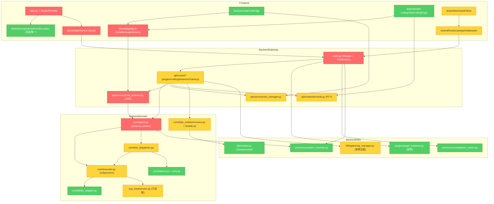

# Open-AwA 稳定性短板清单

> 生成日期: 2026-07-26
> 审计模式: Brooks-Lint Architecture Audit (全栈稳定性视角)
> 审计范围: `lib/backend/` + `lib/frontend/src/`
> Health Score: 22/100
> 本清单仅记录问题（Symptom / Source / Consequence），不含修复方案。

---

## 模块依赖图

---

## Critical 问题

### [Critical-1] 流式响应生命周期不闭环，取消信号丢失

- **Symptom**:
  - `api/services/chat_protocol.py:175-189` 的 SSE `event_generator` 把 `asyncio.CancelledError` 当普通 error yield，未重新 raise
  - `core/agent.py:1454-1495` `_finalize_stream` 中 `feedback.update_memory` 无 try/except 包裹，若抛异常则 `data_collector.collect_conversation` / `unregister_agent_task` 不执行
  - `api/services/ws_manager.py:196-219` 心跳任务异常后永久退出无重启
  - `core/tool_dispatcher.py:197-208` `_dispatch_regular_tool` 中 `await self._executor._execute_tool_call(...)` 未包裹 `asyncio.wait_for`，单工具卡死阻塞整个 Agent
  - 前端 `shared/api/api.ts:612,782` reader 未在 finally 中 `releaseLock()`
  - `features/vibe-coding/components/AcpSessionPanel.tsx:247` 同样遗漏
- **Source**: Martin — Clean Architecture, Acyclic Dependencies Principle + Feathers — Working Effectively with Legacy Code, Ch. 4: The Seam Model
- **Consequence**: 客户端断开 SSE 后后端 agent 任务不终止，后台协程泄漏；单个工具（如 `web_search`）卡死时前端 SSE 永久挂起；高频流式请求异常路径下 ReadableStream 锁累积；活跃任务字典 `_active_agent_tasks` 持续增长直到 OOM

### [Critical-2] lifespan 启动期无降级，任一组件失败整个服务起不来

- **Symptom**:
  - `main.py:1018-1068` lifespan 主体用单一 `try/except` 包裹所有 `_startup_*`，任一抛异常则 `raise` 终止整个服务
  - `main.py:1037-1041` 顺序 `_startup_infrastructure -> _startup_data_init -> _startup_plugin_system -> _startup_background_tasks`，前一个失败后续都不执行
  - `main.py:1056-1061` `data_collector.start` 失败仅 warning，但后续 `agent._finalize_stream` 仍调用 `data_collector.collect_conversation` 触发未初始化错误
  - `main.py:864-876` `_startup_autonomous_mode` 内部 `raise` 终止启动
  - `main.py:806-807` `scheduled_task_manager.start()` 未 try/except
  - `main.py:1044-1050` `task_runtime.initialize` 失败仅 warning，但任务悬挂回收不执行
- **Source**: Martin — Clean Architecture, Stable Dependencies Principle + Brooks — The Mythical Man-Month, Ch. 4: Conceptual Integrity
- **Consequence**: 向量库 Qdrant 不可达、LLM provider 配置错、Plugin Manager 初始化失败、ACP SDK 缺失等任一情况都会让整个后端无法启动；后台任务启动失败仅 warning，但被运行期依赖的代码会每次调用都抛未初始化异常，导致每次对话 finally 都失败、活跃任务字典泄漏

### [Critical-3] 异常类型失真，内部细节透传到前端

- **Symptom**:
  - `main.py:1367-1401` 全局 `@app.exception_handler(Exception)` 把 `asyncio.CancelledError` / `WebSocketDisconnect` / `SQLAlchemyError` / `TimeoutError` 全部映射为 500 + "Internal server error"，丢失根因分类
  - `api/routes/plugins.py:881,918,957,988,1106,1147,1209,1264,1304` 9 处 `except Exception as e: raise HTTPException(status_code=500, detail=str(e))` 把内部异常字符串（含密钥/路径/SQL）原样透传到前端
  - `api/routes/coding.py:820,837,854` 把 mammoth/openpyxl 解析异常细节返回前端，可能泄露服务器路径
  - `api/routes/behavior.py:226-228` `except Exception: db.rollback(); raise HTTPException(500, "行为日志写入失败")` 完全吞掉原始异常类型与 message
  - `api/routes/acp.py:601-604` `raise HTTPException(500, detail=f"ACP service 未初始化: agent={agent}")` detail 含内部状态
  - `api/routes/search_config.py:249-259` 兜底 `except Exception as exc:` 仅 `logger.error(f"...异常: {exc}")` 未带 `exc_info=True`
- **Source**: Evans — Domain-Driven Design, Ubiquitous Language + Fowler — Refactoring, Duplicate Code
- **Consequence**: 前端无法区分超时/网络/配置错误；`asyncio.CancelledError` 被当 500 让取消信号在中间件层被吞；异常字符串透传到前端可能泄露 SECRET_KEY 路径、数据库表结构、内部状态，违反 AGENTS.md §7.2 安全约束；运维侧因日志缺 `exc_info=True` 无法定位根因

### [Critical-4] 前端顶层 ErrorBoundary 无局部降级，子组件异常拖垮整页

- **Symptom**:
  - `lib/frontend/src/App.tsx:75` 仅在 RouterProvider 外包一层 `<ErrorBoundary name="Root">`，任何路由内部抛错顶替整个应用壳层
  - `features/chat/ChatPage.tsx` 内部 ConversationSidebar / MessageList / ToolCallPanel / TodoPanel 等子区域无独立 ErrorBoundary
  - `features/vibe-coding/VibeCodingPage.tsx:107` `new EventSource('/api/notifications/stream')` 在 useEffect 中创建，SSE 解析异常会冒泡到 VibeCoding 路由 ErrorBoundary 让整页降级
  - `shared/components/ErrorBoundary/ErrorBoundary.tsx:131` 通过 `key={retryKey}` 强制重挂 children，初始化阶段即抛错时会陷入抛错-重挂循环
  - `router/index.tsx:106` `dev/test` 路由未用 `withSuspense` 包裹
  - `router/index.tsx:120` `user-profile` 路由重复定义
- **Source**: McConnell — Code Complete, Ch. 7: High-Quality Routines + Ousterhout — A Philosophy of Software Design, Ch. 4: Modules Should Be Deep
- **Consequence**: 任一子组件（如消息渲染、工具调用面板、TODO 面板）抛错会让整个 ChatPage 白屏；SSE 解析的瞬时异常会让 VibeCoding 整页降级；重试循环让用户必须刷新页面才能恢复

### [Critical-5] 前端 API 客户端无 timeout，401 不 logout，UI 永久卡死

- **Symptom**:
  - `lib/frontend/src/shared/api/client.ts:237` `axios.create` 未配置 `timeout`，所有请求默认无超时
  - `client.ts:313` 401 错误仅对 `/auth/me` 跳过日志，其他端点 401 不会触发 logout 或跳转登录页
  - `client.ts:320` 仅处理 403 CSRF 错误自动重试，未处理 401 / 502 / 503 / `ERR_NETWORK`
  - `client.ts:375` 网络错误（无 `error.response`）直接 `Promise.reject(error)`，UI 层无统一降级提示
  - `client.ts:351` `backendDetail = error?.response?.data?.detail` 仅取 detail 字段，部分后端错误格式为 `error.code` / `error.message` 会丢失上下文
  - `features/chat/hooks/useChatStream.ts:19` `MAX_STREAM_RETRY_COUNT = 1`，瞬态网络抖动仅重试 1 次
  - `features/chat/hooks/useChatStream.ts:150` `JSON.parse(localStorage.getItem('app_settings') || 'null')` 未 try/catch
  - `features/settings/containers/SearchTabContainer.tsx:67` AbortController abort 后 `setConfig` 仍可能更新已卸载组件 state
- **Source**: Martin — Clean Architecture, Dependency Inversion Principle + Hunt & Thomas — The Pragmatic Programmer, Ch. 2: Orthogonality
- **Consequence**: 后端慢响应让前端 loading 状态无限挂起；token 过期后用户继续操作看到一堆 401 错误提示；localStorage 污染让用户彻底无法发送消息；网络错误无统一降级让用户只能逐个关闭错误 toast

---

## Warning 问题

### [Warning-1] 全局可变状态无上限/无锁，并发竞态与 OOM 风险

- **Symptom**:
  - `billing/pricing_manager.py` `PricingManager` 类无 `asyncio.Lock` / `threading.Lock`，实例方法可被多请求并发调用
  - `core/agent_registry.py:55-81` `_request_locks: Dict[int, asyncio.Lock]` 无上限，恶意请求大量 `user_id` 会 OOM，无 LRU 淘汰
  - `api/services/ws_manager.py:38-47` `_session_connections` / `_last_activity` 字典无总容量上限
  - `plugins/plugin_instance.py:22-35` `get()` 双重检查但 `_instance` 自动创建路径会绕过 `init()` 配置
  - `core/agent.py:79-141` `_active_agent_tasks` Dict + RLock 保护 register/unregister，但 `_cleanup_completed_tasks` 在容量满时同步执行遍历全部任务
- **Source**: Martin — Clean Architecture, Stable Dependencies Principle + Hunt & Thomas — The Pragmatic Programmer, Ch. 2: Orthogonality
- **Consequence**: 多请求并发更新 PricingManager 缓存导致定价不一致；恶意用户构造大量 user_id 让 agent_registry 内存爆涨；ws_manager 在长期运行后 session 字典无限增长；plugin_instance 提前调用 `get()` 得到无 DB 单例

### [Warning-2] logout 未级联清理业务 store，跨账号数据残留

- **Symptom**:
  - `lib/frontend/src/shared/store/authStore.ts:43` `logout` 仅 `set({ user: null, apiKey: null, isAuthenticated: false })`，未清理 sessionStore / toolCallStore / inboxStore / modelStore
  - `shared/hooks/useAppInitialization.ts:27` `cachedInitializationResult` 模块级单例登出后未清空
  - `shared/api/client.ts:159` `refreshCsrfToken` 在 `!getCachedApiKey()` 时直接 return，登出后 `_csrfToken` 内存变量未清空
  - `features/chat/store/sessionStore.ts:199` `clearMessages` action 存在但 logout 流程未调用
  - `features/chat/hooks/useChatStream.ts:403` `useSessionStore.getState().isLoading` 全局判定，跨页面切回时若上次 isLoading 未复位，新消息发送会被永久阻塞
  - `features/chat/hooks/useChatStream.ts:367` `abortStream` 仅 abort controller，未重置 `activeRequestIdRef`，旧请求的 setLoading(false) 可能覆盖新请求的 loading 状态
  - `features/inbox/inboxStream.ts:165` `getCachedApiKey()` 失效后 onclose 仍会重连 5 次
- **Source**: Fowler — Refactoring, Divergent Change + Winters et al. — Software Engineering at Google, Ch. 1: Hyrum's Law
- **Consequence**: 登出后再登录看到上一账号的会话/工具调用/收件箱消息，违反隐私隔离；CSRF token 复用导致状态变更请求 403；`cachedInitializationResult` 让新用户跳过初始化引导；跨标签页登出时另一标签页消息不会清除

### [Warning-3] ACP SSE queue 阻塞 + run_turn_task cancel 挂起

- **Symptom**:
  - `api/routes/acp.py:680-716` SSE `event_generator` 中 `run_turn_task` 异常时仅 put error 帧，若客户端已断开 `queue.get()` 仍阻塞 30s 才发心跳
  - `run_turn_task.cancel()` 后 `await run_turn_task` 可能挂起（ACP 子进程不响应取消）
  - `acp_host/service.py:805-807` `_kill_process_tree` 失败时仅 log warning，ACP 子进程残留
- **Source**: Fowler — Refactoring, Speculative Generality + Ousterhout — A Philosophy of Software Design, Ch. 3: Tactical Programming Debt
- **Consequence**: ACP 会话客户端断开后，后端 SSE 协程阻塞 30s 才退出，大量并发 ACP 会话时协程池耗尽；`run_turn_task.cancel()` 不响应时永久挂起，task 字典泄漏；ACP 子进程残留占用系统资源

### [Warning-4] 子进程 wait 无超时，僵尸进程累积

- **Symptom**:
  - `core/executor.py:2871-2913` `asyncio.create_subprocess_exec` 在 `TimeoutError` / `Exception` 路径有 `kill + wait`，但 `proc.wait()` 未加超时，子进程不响应 SIGKILL 时无限挂起
  - `core/executor.py:2877-2880` `asyncio.wait_for(proc.communicate(), timeout=30)` 写死 30s 无法按工具配置
  - `api/routes/terminal.py:71-102` `_add_session` LRU 淘汰时仅 `sessions_dict.popitem(last=False)`，未调用 `session.close()` / `session.terminate()`，PTY 子进程残留
  - `api/routes/terminal.py:917-927` finally 中 `except (asyncio.CancelledError, Exception): pass` 吞掉所有异常，PTY 子进程退出信号可能被掩盖
- **Source**: Feathers — Working Effectively with Legacy Code, Ch. 4: The Seam Model
- **Consequence**: 子进程不响应 SIGKILL 时 Agent 协程永久阻塞；30s 超时对所有工具一刀切，长任务被误杀，短任务浪费时间；PTY 子进程残留

### [Warning-5] useAppInitialization 失败时假定已初始化

- **Symptom**:
  - `lib/frontend/src/shared/hooks/useAppInitialization.ts:244` `init-status` 接口失败时"假定已初始化"`setSystemInitialized(true)`，绕过 setup 引导
  - `features/inbox/inboxStream.ts:139` 达到 `MAX_RECONNECT_ATTEMPTS=5` 后直接停止重连，UI 层无降级提示
  - `features/discussions/components/DiscussionStream.tsx:194` `new EventSource(url, { withCredentials: true })` Cookie 失效时静默失败无 token 兜底
  - `features/vibe-coding/VibeCodingPage.tsx:107` `eventSource.onerror` 仅记日志无重连机制，连接断开后通知功能静默失效
- **Source**: Evans — Domain-Driven Design, Ubiquitous Language + Hunt & Thomas — The Pragmatic Programmer, Topic 4: Good-Enough Software
- **Consequence**: 未初始化系统误走认证流程；inbox 实时通道断开后用户无感知；DiscussionStream Cookie 失效时静默失败

### [Warning-6] SessionLocal 散落 22 处，生命周期管理碎片化

- **Symptom**:
  - `core/task_runtime/runners.py:463,502,554,665,705,746,810,853,906,1007,1054,1097,1138` 13 处 `db = SessionLocal()`，部分在同步函数中若被 async 函数直接调用会阻塞事件循环
  - `core/task_runtime/facade.py:49,223,233,253,331,352,374,391,403` 9 处同模式
  - `api/routes/chat.py:715-743` WebSocket 端点 `db = SessionLocal()` + `AIAgent(db_session=db)`，但 `AIAgent.bind_db` 会覆盖引用，close 时关闭的是原始 session，bind 后的 session 可能未关闭
  - `core/agent.py:252-266` `_initialize_memory_dependencies` 中 `MemoryManager(SessionLocal)` 传入 sessionmaker，MemoryManager 内部 session 跨请求复用可能泄漏
  - `main.py:188,419,448,457,494,577,711,841` 多处 `db = SessionLocal()` 用 try/finally 包裹，但 `pricing_manager` 内部可能缓存了 db 引用，后续调用复用已关闭 session
- **Source**: Fowler — Refactoring, Duplicate Code + Hunt & Thomas — The Pragmatic Programmer, DRY: Don't Repeat Yourself
- **Consequence**: db session 泄漏导致 SQLite 文件锁累积；同步函数中调用 `SessionLocal()` 阻塞事件循环；`bind_db` 覆盖引用后原始 session 未关闭，连接池耗尽

### [Warning-7] 前端 reader releaseLock 模式重复 3 处

- **Symptom**:
  - `shared/api/api.ts:612` `sendMessageStream` 中 `response.body.getReader()` 未在 finally 中 `releaseLock()`
  - `shared/api/api.ts:782` `resubscribeStream` 同样问题
  - `features/vibe-coding/components/AcpSessionPanel.tsx:247` ACP prompt 流的 reader 仅在超过 10MB 时 `controller.abort()`，正常完成或异常路径均未调用 `releaseLock` / `cancel`
  - `features/chat/hooks/useChatStream.ts:422,872` `activeAbortControllerRef.current?.abort()` 仅断开 fetch，未 await `reader.cancel()` 通知后端任务停止
- **Source**: Fowler — Refactoring, Duplicate Code + Martin — Clean Architecture, DRY
- **Consequence**: 高频流式请求异常路径下 ReadableStream 锁累积，长期运行后阻塞所有 chat 请求；ACP 流泄漏让浏览器内存持续增长

### [Warning-8] 资源释放路径不闭环

- **Symptom**:
  - `api/routes/preview_proxy.py:115-145` `client = httpx.AsyncClient()` 未用 `async with`，若 `upstream_cm.__aenter__` 抛非 `RequestError` 异常（如 `httpx.HTTPStatusError`），client 不会被关闭
  - `im/feishu_adapter.py:24-44` `start()` 中 `httpx.AsyncClient` 创建后，若认证 POST 抛异常，`self._client` 已创建但 `self._running=False` 后 raise，调用方未调 `stop()` 则 `_client` 泄漏（dingtalk_adapter.py / telegram_adapter.py 同模式）
  - `plugins/bilibili_toolkit_builtin/bilibili/client.py:75-84` `BiliClient.__init__` 在构造时创建 `httpx.AsyncClient`，插件 unload 时若未显式调用 `close()`，客户端不会 aclose
  - `api/routes/chat.py:304-342` SSE 路径在 `task_manager.register_task` / `start_task` 抛异常时，已注册的 task_id 不会被清理
  - `features/chat/hooks/usePermissionRequest.ts:224` `eventSource.onerror` 中 `setTimeout(...)` 重连，timer ref 未保存，组件卸载时无法 clearTimeout
- **Source**: Feathers — Working Effectively with Legacy Code, Ch. 4: The Seam Model + Fowler — Refactoring, Duplicate Code
- **Consequence**: httpx client 泄漏导致连接池耗尽；插件 unload 后 httpx 客户端残留；孤儿 task 记录累积；已卸载组件的 SSE 重连调用造成内存泄漏与 React 警告

### [Warning-9] 超时与降级链路总耗时无上限

- **Symptom**:
  - `core/failover.py:268-362` `execute_with_failover` 按候选链串行调用，无总超时上限；若 N 个候选都超时 60s，总时长 N*60s
  - `core/litellm_adapter.py:635-640` `_call_with_timeout` 用 `asyncio.wait_for` 包裹，但调用方传入的 coro 若已 await 部分，超时后 cancel 不会回滚已产生的副作用（如已扣费）
  - `core/retry.py:55-115` `execute_with_retry` 默认 `retryable_exceptions=(Exception,)`，会把 `asyncio.TimeoutError` 也重试，但 `max_attempts` 用尽后返回 `RetryResult.success=False`，调用方需主动检查
  - `core/builtin_tools/web_search.py:148,267,300,580` 多个 `asyncio.wait_for` 已设超时，但降级链路（SearXNG -> DuckDuckGo -> Bing）总耗时无上限，单次 `web_search` 可能 4*15s=60s
  - `core/litellm_adapter.py:179-191` `get_shared_client` 全局单例 `timeout=60s` `max_connections=100`，若并发请求都触发 60s 超时，连接池快速耗尽
  - `core/tool_dispatcher.py:142-163` `ask_user` 工具默认 `timeout=300`，但 `await ask_future` 无外层 `wait_for`，仅依赖 port 内部超时
- **Source**: Martin — Clean Architecture, Stable Dependencies Principle + Winters et al. — Software Engineering at Google, Ch. 21: Dependency Management
- **Consequence**: failover 链路总耗时不可控；超时后已扣费不回滚；retry 用尽后调用方误当成功继续；web_search 单次 60s 阻塞 Agent；连接池耗尽让新请求排队

### [Warning-10] WebSocket 端点异常路径连接残留

- **Symptom**:
  - `api/routes/chat.py:715-743` WebSocket 端点 `try: ... finally: db.close()`，但若 `ws_manager.connect`（719 行）抛异常，`disconnect` 不会被调用，连接残留且 db 已 close
  - `api/routes/terminal.py:878-889` `_push_output` 中 `except Exception: raise WebSocketDisconnect()` 把 JSON 序列化错误也归类为断开，错误分类不准
- **Source**: Feathers — Working Effectively with Legacy Code, Ch. 4: The Seam Model
- **Consequence**: WebSocket 连接残留导致 ws_manager 字典膨胀；db 已 close 后续操作失败；JSON 序列化错误被误分类为断开让重连逻辑误触发

---

## Suggestion 问题

### [Suggestion-1] 日志兜底未带 exc_info，根因丢失

- **Symptom**:
  - `api/routes/search_config.py:249-259` 兜底 `except Exception as exc:` 仅 `logger.error(f"...异常: {exc}")` 未带 `exc_info=True`
  - 类似模式在多个路由出现
- **Source**: Hunt & Thomas — The Pragmatic Programmer, Ch. 2: Orthogonality
- **Consequence**: 运维侧因缺堆栈无法定位根因，每次排查都要复现

### [Suggestion-2] main.tsx 全局 error 监听未保存 handler 引用

- **Symptom**:
  - `lib/frontend/src/main.tsx:34` 全局 `window.addEventListener('error', ...)` 与 `window.addEventListener('unhandledrejection', ...)` 未保存 handler 引用
  - HMR / 模块重载时重复绑定造成内存泄漏与重复日志
- **Source**: Fowler — Refactoring, Speculative Generality
- **Consequence**: 开发期 HMR 多次重载后日志重复 N 次

### [Suggestion-3] _seed_builtin_plugins_sync 部分种子写入失败仅 warning

- **Symptom**:
  - `main.py:543-787` `_startup_plugin_system` 中 `_seed_builtin_plugins_sync` 的 `db.commit()` 失败仅 warning + rollback
  - 可能留下部分种子数据未写入（如 system-tools 已写入但 bilibili-toolkit 未写入）
- **Source**: Fowler — Refactoring, Shotgun Surgery
- **Consequence**: 系统重启后部分内置插件缺失，用户感知为"功能不全"

### [Suggestion-4] ReasoningContent setInterval 状态切换依赖隐式 cleanup

- **Symptom**:
  - `features/chat/components/ReasoningContent.tsx:54` setInterval 已在 unmount 时清理
  - 但 `isStreaming` 状态切换时依赖 return cleanup 兜底，若 `streamingStartRef.current` 未正确复位可能导致多次创建 timer
- **Source**: Fowler — Refactoring, Speculative Generality
- **Consequence**: 极端情况下 reasoning 面板 timer 重复创建导致 UI 卡顿

### [Suggestion-5] inboxStream 单例 connectCount 跨标签页无同步

- **Symptom**:
  - `features/inbox/inboxStream.ts:155` reconnectTimer 在 disconnectInternal 中已清理
  - 但单例模式下 `connectCount` 跨标签页无同步机制，多标签页快速开关可能让计数失配
- **Source**: Winters et al. — Software Engineering at Google, Ch. 1: Hyrum's Law
- **Consequence**: 多标签页场景下 inbox 重连计数失配，极端情况重连次数超预期

---

## 问题汇总统计

| 严重性 | 数量 | 主要分布 |
|--------|------|----------|
| Critical | 5 | 流式响应生命周期 / lifespan 降级 / 异常透传 / 前端 ErrorBoundary / 前端 API client |
| Warning | 10 | 全局状态锁 / logout 级联 / ACP queue / 子进程 wait / useAppInit / SessionLocal 散落 / reader releaseLock / 资源释放 / 超时降级 / WebSocket 残留 |
| Suggestion | 5 | 日志 exc_info / HMR cleanup / 种子事务 / setInterval / inbox connectCount |
| 合计 | 20 | - |

## 问题分布热力图

| 模块 | Critical | Warning | Suggestion | 小计 |
|------|----------|---------|------------|------|
| `lib/backend/main.py` | 2 | 1 | 1 | 4 |
| `lib/backend/api/services/` | 1 | 2 | 0 | 3 |
| `lib/backend/api/routes/` | 1 | 3 | 1 | 5 |
| `lib/backend/core/agent.py` | 1 | 1 | 0 | 2 |
| `lib/backend/core/tool_dispatcher.py` | 1 | 0 | 0 | 1 |
| `lib/backend/core/executor.py` | 0 | 1 | 0 | 1 |
| `lib/backend/core/task_runtime/` | 0 | 1 | 0 | 1 |
| `lib/backend/billing/` | 0 | 1 | 0 | 1 |
| `lib/backend/acp_host/` | 0 | 1 | 0 | 1 |
| `lib/frontend/src/shared/api/` | 2 | 1 | 0 | 3 |
| `lib/frontend/src/shared/store/` | 0 | 1 | 0 | 1 |
| `lib/frontend/src/shared/hooks/` | 0 | 1 | 0 | 1 |
| `lib/frontend/src/shared/components/ErrorBoundary/` | 1 | 0 | 0 | 1 |
| `lib/frontend/src/features/chat/` | 1 | 2 | 1 | 4 |
| `lib/frontend/src/features/vibe-coding/` | 1 | 1 | 0 | 2 |
| `lib/frontend/src/features/inbox/` | 0 | 1 | 1 | 2 |
| `lib/frontend/src/features/discussions/` | 0 | 1 | 0 | 1 |
| `lib/frontend/src/App.tsx` + `main.tsx` + `router/` | 1 | 0 | 1 | 2 |

## 一句话总结

项目"主干路径能跑、边界场景必崩"——20 个稳定性短板中 5 个 Critical 全部指向同一个根因：错误传播与资源生命周期缺少一致性契约（SSE 取消信号无 seam 传播、lifespan 无降级策略、异常透传到前端、前端 API 无 timeout/无局部 ErrorBoundary、前端 reader 锁泄漏）。
