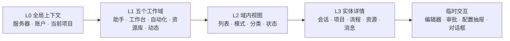

# 统一信息架构与三端导航规范

## 1. 设计原则

1. **任务优先**：一级入口回答“我要做什么”，不回答“代码里有多少页面”。
2. **能力唯一归属**：每个能力只有一个规范入口，其他位置只能是带上下文的快捷操作。
3. **同树异形**：三端共享领域树和路由语义，但按平台使用不同导航组件。
4. **渐进展开**：一级工作域、二级视图、三级实体详情和临时面板各司其职。
5. **成熟度门控**：未达到平台发布门槛的能力不进入正式导航。
6. **搜索补充导航**：低频功能通过全局搜索或命令面板直达，不靠增加永久入口解决。

## 2. 四层导航模型



L4 不属于永久导航。关闭临时交互后，用户必须回到同一个 L3 实体，而不是跳到另一领域。

## 3. 五个一级工作域

### 3.1 助手

默认路径：`/assistant`

| 二级视图 | 内容 | 不再单列的入口 |
|---|---|---|
| 当前对话 | 消息流、输入、附件、思考和工具过程 | `/chat` |
| 会话 | 历史会话、搜索、归档和批量管理 | 聊天页历史侧栏 |
| 上下文 | 当前角色、项目、知识和声音选择 | 角色选择、记忆选择、TTS 快捷入口 |

角色、记忆和声音在这里是“当前对话上下文”，它们的管理仍归资源库。

### 3.2 工作台

默认路径：`/workbench/projects`

| 二级视图 | 内容 | 淘汰的旧页面 |
|---|---|---|
| 项目 | 工作区列表、最近项目、远程环境 | `/workspace` |
| 编辑 | 文件树、编辑器、搜索、Git/Diff、LSP | `/coding` |
| Agents | ACP Agent、会话、权限审批、终端、文件预览 | `/vibe-coding` |

工作台以 `project_id` 为持续上下文。用户从“项目”进入“编辑”或“Agents”时不丢失文件、终端和 Agent 会话状态。

### 3.3 自动化

默认路径：`/automations/overview`

| 二级视图 | 内容 | 淘汰的旧页面 |
|---|---|---|
| 概览 | 运行中、等待审批、失败、近期计划 | 零散状态卡片 |
| 流程 | 工作流定义、版本、触发器和步骤编排 | `/workflows` |
| 计划 | Cron、日历、AI 任务和插件任务 | `/scheduled-tasks` |
| 执行者 | 子智能体模板、资源限制和可用状态 | `/subagents` |
| 运行 | 执行记录、日志、产物、审批和协作 | `/discussions` 作为独立页 |

“讨论”改为某个运行详情的 `协作` Tab，路径为 `/automations/runs/:runId/collaboration`。

### 3.4 资源库

默认路径：`/library/capabilities`

| 二级视图 | 三级分类 | 淘汰的旧页面 |
|---|---|---|
| 能力 | 技能、插件；每类均有“已安装 / 发现”筛选 | `/skills`、`/skills/market`、`/plugins/manage`、独立插件市场 |
| 角色 | 已有角色、发现角色 | `/roles`、`/role-market` |
| 知识 | 短期记忆、长期记忆、经验、质量 | `/memory`、`/experience` |
| 声音 | 语音合成、音色、克隆声音 | `/tts` |

资源详情使用 `/library/:type/:id`。安装、启用、配置、权限和日志属于资源详情内的 Tab 或动作，不再扩张为全局页面。

### 3.5 动态

默认路径：`/activity/overview`

| 二级视图 | 内容 | 淘汰的旧页面 |
|---|---|---|
| 概览 | 关键指标、系统资源、近期活动、失败摘要 | `/dashboard` |
| 收件箱 | 系统消息、任务通知、外部渠道消息 | `/inbox` |
| 用量 | Token、成本、预算、价格与报表 | `/billing` |
| 系统 | 健康、服务和运行状态，仅管理员可见 | 分散的系统状态入口 |

IM 渠道配置不在“动态”，而在“设置 > 连接”。动态只消费消息，不配置消息来源。

## 4. 账户与设置

头像菜单始终提供：账户、设置、切换服务器、问题反馈、退出登录。它们不计入五个一级工作域。

### 4.1 账户

规范路径：`/account`

- 个人信息与密码
- 设备和登录会话
- 画像总览
- 事实管理
- 洋葱画像

`/user` 和 `/user-profile` 的页面实现合并，保留一个账户页面。

### 4.2 设置

规范路径：`/settings/:section`

| 设置分区 | 合并内容 |
|---|---|
| 通用 | 语言、默认行为、通知偏好 |
| 模型与供应商 | API、模型、默认模型、价格来源 |
| AI 与个性 | 提示词、搜索、画像学习参数 |
| 连接 | 后端服务器、IM/微信、MCP |
| 数据与隐私 | 数据采集、保留、导出和删除 |
| 安全与权限 | 安全、权限、环境变量和审计 |
| 外观与伴侣 | 主题、布局、桌面宠物 |
| 用量与预算 | 预算规则和计费配置；实际用量仍在动态 |

## 5. 单一导航清单

三端不得继续在 `Sidebar.tsx`、Electron 菜单和 `Destination.kt` 中分别手写相同知识。目标是建立一个版本化的导航清单，并为 TypeScript 与 Kotlin 生成只读类型。

建议的概念结构：

```yaml
version: 2
domains:
  - id: assistant
    canonical_path: /assistant
    label_key: nav.domain.assistant
    order: 10
    platforms: [web, desktop, android]
    children:
      - id: sessions
        canonical_path: /assistant/sessions
        required_capability: chat.sessions.read
        minimum_readiness: stable
```

清单至少包含：

- 稳定 `id`、父子关系和排序
- 规范路由和旧路由重定向
- 文案键与图标语义键
- 权限要求和功能开关
- 平台可用性与最低成熟度
- 是否允许离线、是否需要项目上下文
- 深链和选中态匹配规则

清单不包含布局像素、颜色或平台组件名。平台投影层负责把同一语义映射为 Sidebar、Menu、NavigationBar、NavigationRail 或 Drawer。

## 6. Web 导航

### 6.1 大屏布局

```text
┌──────────┬──────────────────────┬────────────────────────────────────────────┐
│ 领域轨道 │ 当前领域子导航       │ 内容区                                     │
│ 56 px    │ 224–280 px           │ 标题 / 情境操作 / 实体内容                 │
│          │                      │                                            │
│ 助手     │ 会话                 │                                            │
│ 工作台   │ 项目 / 编辑 / Agents │                                            │
│ 自动化   │ 概览 / 流程 / 计划   │                                            │
│ 资源库   │ 能力 / 角色 / 知识   │                                            │
│ 动态     │ 概览 / 收件箱 / 用量 │                                            │
│          │                      │                                            │
│ 搜索     │                      │                                            │
│ 头像     │                      │                                            │
└──────────┴──────────────────────┴────────────────────────────────────────────┘
```

- 领域轨道只显示五个稳定图标和文字提示。
- 子导航面板只显示当前领域，不再渲染整棵产品树。
- 子导航面板可以折叠；折叠状态按设备保存。
- 内容标题栏只放当前实体操作，例如“新建流程”或“运行”。
- 全局搜索使用 `/` 或 `Ctrl+K` 打开，可检索页面、实体和命令。

### 6.2 响应式投影

| 宽度 | 导航方式 |
|---|---|
| `>= 1440px` | 领域轨道 + 永久子导航 + 内容 |
| `1024–1439px` | 领域轨道 + 可折叠子导航 + 内容 |
| `768–1023px` | 领域轨道 + 临时子导航面板 + 内容 |
| `< 768px` | 五项底栏 + 顶部标题；二级视图用页面内 Tab/选择器 |

当前 `mobileHidden` 方案应删除。移动端不是隐藏桌面导航中的若干项，而是从同一领域树投影为五项底栏。

## 7. Electron 桌面端导航

### 7.1 原生职责边界

| 原生主进程负责 | 渲染层负责 |
|---|---|
| 窗口、托盘、更新、系统通知、全局快捷键、文件对话框 | 领域轨道、子导航、内容路由、实体状态 |
| 系统菜单中的命令 | 命令执行后的页面呈现 |

系统菜单不复制五个领域的所有子项。建议菜单结构：

- 文件：新建对话、新建项目、打开项目、关闭当前视图、退出
- 编辑：撤销、重做、剪切、复制、粘贴、全选
- 前往：助手、工作台、自动化、资源库、动态、后退、前进
- 视图：切换子导航、命令面板、缩放、全屏、开发者工具
- 窗口：最小化、最大化、关闭
- 帮助：文档、问题反馈、检查更新、关于

### 7.2 桌面工作流

- 使用紧凑原生标题栏显示当前项目、连接状态和窗口按钮。
- 左侧领域轨道保持 56 px；工作台子导航可显示项目树和最近文件。
- `Ctrl+K` 打开命令面板；`Ctrl+Shift+N` 新建对话；现有显示窗口快捷键继续保留。
- 托盘仅保留“显示主窗口、快速提问、查看运行中任务、退出”，不承载完整导航。
- 系统通知点击后通过 `command_id` 打开对应规范路由和实体。

## 8. Android 原生导航

Android 使用 Material 3 自适应导航，不再以汉堡抽屉承载全部页面。

| 窗口宽度 | Material 3 组件 | 嵌套方式 |
|---|---|---|
| Compact `< 600dp` | `NavigationBar` | 五个工作域固定在底部；二级视图用顶部 Tab 或下拉；三级详情压栈 |
| Medium `600–839dp` | `NavigationRail` | 左侧五域 Rail；当前域二级列表与内容组成双栏 |
| Expanded `>= 840dp` | 永久 `NavigationDrawer` | 五域和当前域二级项分区展示；详情区独立 |

手机底栏固定为：助手、工作台、自动化、资源库、动态。账户头像位于顶部 App Bar 右侧，不占第六个 Tab。

Android 返回规则：

1. L4 临时面板先关闭。
2. L3 详情返回所属 L2 列表。
3. L2 返回该领域默认视图。
4. 再次返回才退出或进入系统后台。

Android 发布门槛：

- 真实 Repository 已接入并具有加载、空、错误和权限状态。
- 路由有 UI 测试和深链测试。
- 手机、折叠屏/平板至少各完成一次布局验收。
- 未满足门槛的条目由清单标记为不可用，不渲染 `PlaceholderScreen`。

## 9. 导航状态与深链

- 规范 URL 表达当前领域、视图和实体，不把临时弹窗写入主路径。
- Web 与桌面保存每个领域最后访问的 L2 路由。
- Android 为五个领域维护独立 back stack，切换底栏后返回原位置。
- 权限变化或功能下线时，深链进入最近可用父级并显示明确原因。
- 服务器切换时清除实体缓存，但保留不含用户数据的导航偏好。

## 10. 无障碍和键盘规范

- 每个导航容器只能有一个 `aria-current="page"` 或 Compose `selected` 项。
- 图标必须有稳定文本标签；折叠模式使用 Tooltip，但不能以 Tooltip 替代可访问名称。
- Web 与桌面支持方向键遍历、Enter 激活、Esc 关闭临时面板。
- 所有触控目标不小于 48 dp；底栏文字不因系统字体放大而消失。
- 选中态不能只依靠颜色，需同时使用形状、字重或指示条。

