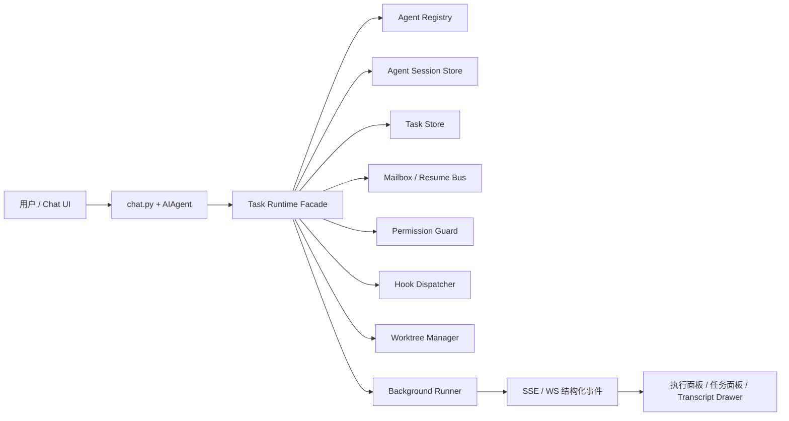

# Claude Code Task 工具族（V2）调研与 Open-AwA 落地方案

## 1. 结论摘要

截至 2026-05，Anthropic 官方已经不再把这套能力单独表述为一个旧式 `Task` 工具，而是将其拆成一组以 `Agent` 为核心的任务委派能力：`Agent` 负责拉起子代理，`SendMessage` 负责继续已有代理或给队友发消息，`TaskCreate/TaskGet/TaskList/TaskUpdate/TaskStop` 负责共享任务清单与后台任务控制，`TeamCreate/TeamDelete` 负责多会话协作，`Hook + Permission + Worktree` 负责治理与隔离。官方文档明确说明：在 2.1.63 版本中，`Task` 工具更名为 `Agent`，但旧写法仍保留兼容别名。

对 Open-AwA 来说，最佳路径不是照搬 Claude Code 的终端 UI，而是复用当前仓库已经存在的三个锚点：

- [backend/core/subagent.py](../backend/core/subagent.py)：已有子 Agent 编排原型
- [frontend/src/features/chat/utils/executionMeta.ts](../frontend/src/features/chat/utils/executionMeta.ts)：已有 `plan/task/tool/usage` 结构化执行面板
- [backend/core/scheduled_task_manager.py](../backend/core/scheduled_task_manager.py)：已有“任务领取 + 运行中恢复 + 隔离上下文执行”的事务模式

因此，建议把“Claude Code Task 工具族 V2”在 Open-AwA 中落成一个新的“任务委派运行时”，而不是继续把当前 `SubAgentManager` 直接扩展成所有能力的承载点。

## 2. 调研范围与命名约定

### 2.1 本文对“Task 工具族 V2”的定义

Anthropic 官方当前文档主要使用 `Agent`、`TaskCreate`、`TeamCreate` 等命名，而不是统一叫“Task V2”。为了便于讨论，本文将 2.1.19 之后逐步成型、并在 2.1.63 之后公开改名为 `Agent` 的这套任务委派体系，统称为“Task 工具族（V2）”。

### 2.2 主要信息源

- Claude Code Subagents 文档：<https://code.claude.com/docs/en/sub-agents>
- Claude Code Tools Reference：<https://code.claude.com/docs/en/tools-reference>
- Claude Code Hooks Reference：<https://code.claude.com/docs/en/hooks>
- Claude Code Permissions：<https://code.claude.com/docs/en/permissions>
- Claude Code Agent Teams：<https://code.claude.com/docs/en/agent-teams>
- Claude API Tool Use Overview：<https://platform.claude.com/docs/en/docs/agents-and-tools/tool-use/overview>
- Anthropic 开源仓库变更记录：<https://github.com/anthropics/claude-code>

### 2.3 关键版本演进

| 版本 | 变化 | 对 V2 的意义 |
| --- | --- | --- |
| 2.1.19 | 引入 `CLAUDE_CODE_ENABLE_TASKS` 以切换到新任务系统 | 说明新任务体系在该阶段开始成型 |
| 2.1.30 | `TaskStop` 结果展示改进 | 说明后台任务已成为一等能力 |
| 2.1.33 | 支持 `Task(agent_type)` 限制子代理、增加 `memory` 字段、增加 `TaskCompleted` 钩子 | 任务与子代理治理开始统一 |
| 2.1.63 | 官方文档声明 `Task` 工具更名为 `Agent` | 对外能力名称从 Task 过渡到 Agent |
| 2.1.72 | 恢复 `Agent` 工具的 `model` 参数 | 子代理按次覆盖模型成为正式能力 |
| 2.1.77 | `Agent` 不再接受 `resume` 参数，改由 `SendMessage({to: agentId})` 继续 | 会话续跑与任务派发解耦 |

## 3. Claude Code Task 工具族（V2）能力模型

### 3.1 委派平面：`Agent`

`Agent` 工具是 V2 的中心入口，本质是“派生一个具备独立上下文窗口的子代理”。官方工具输入包含以下核心字段：

- `prompt`：子代理要执行的任务
- `description`：任务短描述，用于任务列表和状态展示
- `subagent_type`：使用哪一种代理定义，例如 `Explore`、`Plan` 或自定义 agent
- `model`：可选的按次模型覆盖

对应语义如下：

- 子代理拥有独立上下文窗口，不会把中间搜索噪音污染主线程
- 子代理可以带独立系统提示词、工具白名单、权限模式、MCP 作用域、记忆目录
- 子代理支持前台和后台两种执行模式
- 子代理支持 `worktree` 隔离
- 子代理不能继续派生新的子代理，嵌套委派由主线程负责

### 3.2 续跑与消息平面：`SendMessage`

`SendMessage` 的职责有两类：

- 给 agent team 的 teammate 发消息
- 通过 `agent_id` 恢复已停止的子代理

2.1.77 之后，恢复不再通过 `Agent(resume=...)` 完成，而是通过 `SendMessage({to: agentId})` 完成，且已停止的子代理会自动在后台恢复。

这说明 V2 已经不再把“派生任务”和“继续任务”混在一个工具里，而是形成了更清晰的生命周期模型。

### 3.3 任务清单平面：`TaskCreate / TaskGet / TaskList / TaskUpdate / TaskStop`

这组工具用于维护共享任务状态，而不是直接执行模型推理。它们负责：

- 创建任务项
- 获取任务详情
- 列出任务清单
- 更新状态、依赖、描述、归属
- 停止运行中的后台任务

在交互式会话中，这组工具对应 Claude Code 的共享任务列表；在非交互和 SDK 模式中，官方还提供 `TodoWrite` 作为兼容性入口。

### 3.4 团队协同平面：`TeamCreate / TeamDelete`

Agent Teams 是更重的一层能力，特点是：

- 每个 teammate 都是独立 Claude Code 会话
- 团队共享任务列表
- 队友之间可以直接发消息，而不是只能回主线程
- 有 lead / teammate / mailbox / task list 四个核心对象

它与单次 `Agent` 派发的最大差异是：团队成员之间可以直接通信，且任务依赖由共享任务列表驱动。

### 3.5 治理平面：Hooks / Permissions / Worktree / Memory

V2 并不是“只加几个工具”这么简单，它还有一整套治理层：

- `PreToolUse` / `PostToolUse`：控制或修正工具调用
- `SubagentStart` / `SubagentStop`：监听子代理生命周期
- `TaskCreated` / `TaskCompleted`：控制任务建单与完结
- `TeammateIdle`：控制 agent team 成员是否允许进入空闲
- `permissionMode`：控制自动通过、自动拒绝、计划模式等
- `isolation: worktree`：给写操作型代理隔离工作副本
- `memory: user/project/local`：给子代理持久记忆

这套治理层是 Claude Code 能把多代理能力真正产品化的关键。

## 4. 与 Open-AwA 现状的对比

### 4.1 当前可复用能力

| Open-AwA 现状 | 已有实现 | 可以复用什么 |
| --- | --- | --- |
| 子 Agent 编排 | [backend/core/subagent.py](../backend/core/subagent.py) | 图编排、顺序/并行执行、节点执行日志 |
| 子 Agent API | [backend/api/routes/subagents.py](../backend/api/routes/subagents.py) | 注册、查询、顺序/并行调用入口 |
| 聊天结构化执行面板 | [frontend/src/features/chat/utils/executionMeta.ts](../frontend/src/features/chat/utils/executionMeta.ts) | `plan/task/tool/usage` 事件消费与渲染 |
| SSE 协议 | [backend/api/services/chat_protocol.py](../backend/api/services/chat_protocol.py) | 结构化事件 `plan/task/tool` 已可透传 |
| 定时任务领取与恢复 | [backend/core/scheduled_task_manager.py](../backend/core/scheduled_task_manager.py) | 显式事务领取、`running -> pending` 恢复、隔离会话上下文 |

### 4.2 当前缺口

| 能力 | 当前状态 | 缺口 |
| --- | --- | --- |
| 子代理会话持久化 | 没有 | 无 `agent_id`、无 transcript、无 resume |
| 子代理定义 | 只有运行时注册 | 无 agent definition、无 prompt/工具/模型/权限配置 |
| 后台任务控制 | 只有定时任务 | 无通用 `TaskStop`、无运行任务目录 |
| 共享任务清单 | 没有 | 无任务依赖、无 claim/update/list/get |
| 代理消息总线 | 没有 | 无 `SendMessage`，无法恢复已停止代理 |
| 团队协同 | 没有 | 无 lead / teammate / mailbox / team state |
| 钩子治理 | 零散 | 无统一 `PreToolUse` / `TaskCompleted` 风格事件 |
| 权限隔离 | 有确认机制，但较粗 | 无 per-agent 工具白名单、无 background 预授权模型 |

### 4.3 核心判断

当前 [backend/core/subagent.py](../backend/core/subagent.py) 更像“LangGraph 风格图执行器”，而不是“Claude Code 风格任务委派运行时”。

因此，不建议直接在这个文件里继续堆功能。更合适的方式是：

- 保留它作为轻量级图编排内核
- 新增独立的 `task_runtime` 层承载代理定义、会话、任务清单和消息总线
- 在聊天链路中把 `task_runtime` 作为可调用工具注册给主 Agent

### 4.4 外部框架横向对比

结合本项目现状，判断一个 subagent 框架是否“适合 Open-AwA”，关键不在于它能不能跑多代理 Demo，而在于它是否满足以下约束：

- Python 优先，能自然嵌入现有 FastAPI 后端
- 不强行接管现有工具系统、记忆体系、SSE 结构化事件和插件体系
- 支持独立子代理上下文、状态持久化、恢复和治理，而不是只做 prompt handoff
- 最好能兼容 MCP、流式输出、审计、权限隔离和工作副本

按这个标准，当前值得重点关注的外部方案如下。

| 框架 | GitHub Stars（2026-05） | 定位 | 对 Open-AwA 的适配判断 |
| --- | --- | --- | --- |
| Claude Code Subagents | 非开源产品能力 | 子代理产品语义、治理和交互模型 | 最适合作为目标能力蓝本，不适合作为直接依赖 |
| LangGraph | 约 31k | 低层状态图编排框架 | 最适合作为运行时内核，和现有 [backend/core/subagent.py](../backend/core/subagent.py) 的迁移路径最短 |
| Deep Agents | 约 22.1k | 基于 LangGraph 的 batteries-included agent harness，内置 planning、filesystem、shell、sub-agents | 最适合作为 PoC 和能力对照样板，不建议整包直接塞进生产主链路 |
| CrewAI | 约 50.5k | 角色化 Crews + 事件驱动 Flows | 适合独立多代理业务流，但会和现有插件、记忆、任务面板产生明显能力重叠 |
| Microsoft Agent Framework | 约 10k | Microsoft 当前主推的企业级多代理框架 | 可作为企业化备选，尤其适合后续需要 A2A、MCP、跨语言治理时 |
| AutoGen | 约 57.7k | 经典多代理框架 | 已进入 maintenance mode，不建议新项目继续采用 |
| Semantic Kernel | 约 27.8k | 企业级 agent SDK / orchestration 框架 | 官方也已导向 Agent Framework，对本项目不是一线候选 |
| OpenAI Swarm | 约 21.4k | 轻量 handoff 实验框架 | 更适合教学和最小原型，不适合作为当前项目主干依赖 |

### 4.5 候选框架的具体判断

#### 4.5.1 Claude Code：最适合拿来定义“产品形态”

Claude Code 的优势不在于“有一个多代理 SDK”，而在于它已经把 subagent 产品化为一套清晰的能力模型：

- 用 Markdown + frontmatter 定义 agent，天然适合项目级配置和版本控制
- 每个子代理都有独立上下文、独立模型、独立工具白名单、独立权限模式
- 支持 `mcpServers`、`memory`、`hooks`、`background`、`isolation: worktree`
- 内建自动委派、显式 @-mention、恢复、后台运行和 transcript 管理语义

对 Open-AwA 来说，Claude Code 最有价值的不是“拿来集成”，而是作为任务委派运行时的语义模板。当前这份文档的主体设计，仍然应该继续沿着 Claude Code 的产品语义推进。

#### 4.5.2 LangGraph：最适合做运行时内核

LangGraph 的优势在于它是低层、可嵌入、Python 友好的状态图运行时，而不是一个会接管你整套产品层的完整应用框架。它和当前 [backend/core/subagent.py](../backend/core/subagent.py) 的思想最接近，但比当前实现多出几个本项目真正缺的能力：

- durable execution，可做失败恢复和长任务持久化
- human-in-the-loop / interrupt，可自然映射审批和人工接管
- memory 与 checkpoint 机制，适合承载 resume 语义
- 原生 streaming、subgraph、branching，更适合作为 `task_runtime` 的执行内核

更重要的是，LangGraph 本身不会强迫 Open-AwA 放弃现有聊天协议、插件体系和前端执行面板，因此迁移成本相对可控。

如果要真正引入一个外部框架，我认为 LangGraph 是当前最稳的第一选择。

#### 4.5.3 Deep Agents：最适合做 Claude Code 风格能力样板

Deep Agents 明确写明自己“主要受 Claude Code 启发”，而且它把 planning、filesystem、shell、sub-agents 和上下文压缩都一起打包了。这意味着它非常适合用来验证两件事：

- Claude Code 风格的子代理委派，在开源栈里到底需要哪些基础能力
- 一个“可直接跑起来”的 agent harness，和 Open-AwA 自研 `task_runtime` 相比，哪些是必须补的运行时特性

但它的问题也很明显：

- 过于 batteries-included，容易和现有工具调用、权限确认、插件加载逻辑重叠
- 官方明确采用“trust the LLM”安全模型，治理更依赖工具和沙箱边界
- 更像一个现成 agent harness，而不是一块可以无痛嵌进现有产品的中间件

所以我的判断是：Deep Agents 值得重点阅读和做 PoC，对设计很有帮助，但不建议直接替代 Open-AwA 的主运行时。

#### 4.5.4 CrewAI：适合独立业务流，不适合直接吞并现有主链路

CrewAI 的优点是成熟、社区大、文档多，且把多代理拆成了 `Crews` 和 `Flows` 两层：前者偏自治协作，后者偏事件驱动和流程控制。这个抽象本身不差，甚至对业务自动化类场景很强。

但对 Open-AwA 来说，它的问题不是“能不能做”，而是“会不会和现有系统打架”：

- 现有项目已经有自己的聊天协议、计划面板、插件系统、记忆系统和任务执行语义
- CrewAI 的工程组织、配置方式、工具生态和观测体系都比较强势
- 仓库本身带匿名 telemetry，虽然可关闭，但企业侧通常会额外关注

因此，CrewAI 更适合作为某个独立实验域或专门工作流产品，而不是直接作为 Open-AwA 主干的 subagent 底座。

#### 4.5.5 Microsoft Agent Framework：可列为企业化备选

这条线需要和 AutoGen / Semantic Kernel 一起看。现在的明确信号是：

- AutoGen 已进入 maintenance mode，并建议新项目迁移到 Microsoft Agent Framework
- Semantic Kernel 官方也已将未来方向导向 Microsoft Agent Framework

Microsoft Agent Framework 本身有几个对 Open-AwA 确实有吸引力的点：

- graph-based workflows
- Python + .NET 双栈支持
- OpenTelemetry 观测、middleware、hosting
- A2A 和 MCP 方向上的官方投入

但它也意味着更重的框架心智和更明显的 Microsoft 技术路线色彩。对当前以 Python/FastAPI 为主、且已有较多自研中间层的 Open-AwA 来说，它更像“未来企业化分支”的备选项，而不是当前最佳落点。

#### 4.5.6 不建议作为新主线依赖的候选

以下方案不建议作为当前项目的新主线依赖：

- AutoGen：社区影响力很大，但官方已转维护模式
- Semantic Kernel：仍值得参考设计，但新项目会被官方引导到 Agent Framework
- OpenAI Swarm：设计简洁，handoff 语义清楚，但官方明确定位为 experimental / educational，并已建议迁移到 OpenAI Agents SDK

## 4.6 选型结论

综合当前仓库现状与外部生态，我建议把“参考对象”和“实际依赖”分开：

1. 产品语义和治理模型，优先对标 Claude Code
2. 真要引入运行时框架，优先选 LangGraph
3. Deep Agents 作为 PoC / Benchmark / 设计样板优先阅读，但不直接替代主链路
4. CrewAI 只在需要独立自治工作流产品时再考虑
5. Microsoft Agent Framework 保留为企业化和跨语言扩展备选
6. AutoGen、Semantic Kernel、Swarm 不建议作为当前阶段的新主线依赖

换句话说，对 Open-AwA 最合适的路线不是“选一个大框架整仓替换”，而是：

- 继续以 Claude Code 的 subagent 语义为设计蓝本
- 在 [backend/core/task_runtime/](../backend/core) 新建运行时层
- 运行图和状态恢复能力优先借助 LangGraph 这样的低层内核
- 把 Deep Agents 作为样板仓库来吸收其 planning / sub-agent / context management 的实现经验

## 5. 设计目标与非目标

### 5.1 设计目标

1. 支持 Claude Code 风格的“主代理派生子代理”
2. 支持独立子代理会话、可恢复 transcript 和 `agent_id`
3. 支持后台运行、停止、恢复、结果摘要回传
4. 支持共享任务清单、依赖和状态流转
5. 支持实验性的 agent team 协同能力
6. 支持权限、钩子、工作副本和审计治理
7. 兼容现有聊天结构化事件面板，尽量少改前端基础设施

### 5.2 非目标

1. 不复制 Claude Code 的终端 TUI 交互
2. 不在第一阶段支持任意深度的嵌套子代理
3. 不在第一阶段复制全部 Hooks 类型，只先实现高价值治理事件
4. 不把定时任务系统和任务委派运行时强行合并为同一套对象

## 6. 总体架构方案



### 6.1 设计原则

- 主线程只负责决策与派发，子线程负责独立执行
- 所有长任务都必须有可恢复状态，而不是只存在内存里
- 任务状态与代理会话状态分离存储
- 背景运行必须走预授权和质量门控
- 所有可见状态都以事件流驱动前端，而不是前端主动拼装推断

## 7. 后端设计

### 7.1 建议新增模块结构

```text
backend/core/task_runtime/
  __init__.py
  facade.py                # 对主 Agent 暴露统一入口
  definitions.py           # AgentDefinition / ToolPolicy / MemoryPolicy
  registry.py              # 代理定义注册与解析
  sessions.py              # 代理会话生命周期
  task_store.py            # TaskCreate/List/Get/Update/Stop
  message_bus.py           # SendMessage / mailbox / resume
  runners.py               # foreground/background 运行器
  permission_guard.py      # per-agent 工具白名单与预授权
  hook_dispatcher.py       # 任务与子代理生命周期事件
  worktree_manager.py      # worktree 隔离
  serializers.py           # transcript / summary / SSE payload
```

### 7.2 核心对象模型

#### 7.2.1 AgentDefinition

用于描述某一类代理，而不是某次运行实例。

建议字段：

- `name`
- `scope`：system / project / user / plugin
- `description`
- `system_prompt`
- `tools`
- `disallowed_tools`
- `model`
- `permission_mode`
- `memory_mode`
- `background_default`
- `isolation_mode`
- `color`
- `metadata`

#### 7.2.2 AgentSession

表示一次真实运行实例。

建议字段：

- `agent_id`
- `parent_session_id`
- `root_chat_session_id`
- `agent_type`
- `state`：created / queued / running / waiting_user / completed / failed / stopped / cancelled
- `run_mode`：foreground / background
- `isolation_mode`：inherit / fresh / worktree
- `transcript_path`
- `summary`
- `last_error`
- `started_at`
- `updated_at`
- `ended_at`

#### 7.2.3 TaskItem

表示共享任务清单中的一项，而不是模型消息。

建议字段：

- `task_id`
- `list_id`
- `subject`
- `description`
- `status`：pending / running / blocked / completed / failed / cancelled
- `dependencies_json`
- `owner_agent_id`
- `owner_teammate_name`
- `result_summary`
- `output_ref`
- `created_at`
- `updated_at`
- `completed_at`

#### 7.2.4 TeamRuntime

用于实验性多代理协作。

建议字段：

- `team_id`
- `name`
- `lead_agent_id`
- `state`：starting / active / cleaning / stopped / failed
- `member_snapshot_json`
- `task_list_id`
- `created_at`
- `updated_at`

### 7.3 建议数据库表

| 表名 | 作用 | 关键字段 |
| --- | --- | --- |
| `task_agent_definitions` | 代理定义表 | `name`, `scope`, `description`, `system_prompt`, `tools_json` |
| `task_agent_sessions` | 代理实例表 | `agent_id`, `parent_session_id`, `state`, `transcript_path` |
| `task_items` | 任务清单项 | `task_id`, `list_id`, `status`, `dependencies_json`, `owner_agent_id` |
| `task_events` | 事件审计流 | `event_type`, `entity_type`, `entity_id`, `payload_json`, `created_at` |
| `task_teams` | team 元数据 | `team_id`, `lead_agent_id`, `state`, `task_list_id` |
| `task_team_members` | team 成员 | `team_id`, `agent_id`, `name`, `state` |
| `task_mailbox_messages` | 代理间消息 | `message_id`, `from_agent_id`, `to_agent_id`, `payload_json`, `delivered_at` |

### 7.4 状态机

#### 7.4.1 AgentSession 状态机

```text
created -> queued -> running -> completed
                       -> waiting_user -> running
                       -> failed
                       -> stopped
                       -> cancelled
```

#### 7.4.2 TaskItem 状态机

```text
pending -> running -> completed
        -> blocked -> pending
        -> failed
        -> cancelled
```

#### 7.4.3 TeamRuntime 状态机

```text
starting -> active -> cleaning -> stopped
                  -> failed
```

### 7.5 工具协议到 Open-AwA 的映射

| Claude Code 工具 | Open-AwA 建议能力 | 说明 |
| --- | --- | --- |
| `Agent` | `task_runtime.spawn_agent()` | 派生子代理，返回 `agent_id` |
| `SendMessage` | `task_runtime.send_message()` | 继续某个 `agent_id` 或给 teammate 发送消息 |
| `TaskCreate` | `task_store.create_task()` | 创建任务项 |
| `TaskList` | `task_store.list_tasks()` | 列出任务清单 |
| `TaskGet` | `task_store.get_task()` | 获取任务详情 |
| `TaskUpdate` | `task_store.update_task()` | 更新状态、依赖、归属 |
| `TaskStop` | `runners.stop_run()` | 停止后台执行 |
| `TodoWrite` | `task_store.sync_todo_snapshot()` | 非交互模式简化入口 |
| `TeamCreate` | `team_manager.create_team()` | 实验性，多代理团队 |
| `TeamDelete` | `team_manager.delete_team()` | 清理团队与成员状态 |

### 7.6 建议的内部接口草案

#### 7.6.1 派生子代理

```json
{
  "agent_type": "Explore",
  "prompt": "分析 backend/api/routes/chat.py 的流式事件结构",
  "description": "调研聊天流式事件",
  "model": "haiku",
  "background": false,
  "isolation": "fresh"
}
```

返回：

```json
{
  "agent_id": "agt_01HXYZ",
  "status": "running",
  "run_mode": "foreground",
  "transcript_path": "data/task_runtime/transcripts/agt_01HXYZ.jsonl"
}
```

#### 7.6.2 继续子代理

```json
{
  "to": "agt_01HXYZ",
  "message": "继续之前的分析，并补充 SSE 事件字段清单"
}
```

#### 7.6.3 创建任务项

```json
{
  "list_id": "team-auth-refactor",
  "subject": "梳理聊天 SSE 事件协议",
  "description": "产出 plan/task/tool/usage 事件契约",
  "dependencies": []
}
```

### 7.7 并发与恢复策略

这里建议直接复用 [backend/core/scheduled_task_manager.py](../backend/core/scheduled_task_manager.py) 里已经验证过的模式：

- 用显式事务领取待执行记录
- 启动时把遗留 `running` 状态回收为 `pending`
- 执行记录与状态推进在同一事务中写入
- 每次运行都带隔离上下文标志

具体到 Task V2，可演化为：

1. `task_agent_sessions` 领取运行权时写入 `lease_owner` 和 `lease_expires_at`
2. 运行中周期性心跳续租
3. 进程重启时回收超时 lease
4. `TaskStop` 先改状态为 `stopping`，再由 runner 做实际取消

### 7.8 隔离模式设计

建议先支持三种模式：

- `inherit`：沿用父会话工作目录与工具集，适合只读调研
- `fresh`：仅带 agent definition 和必要上下文，适合减少污染
- `worktree`：创建隔离工作副本，适合可能修改代码的后台代理

对写代码型代理，建议默认：

- 前台可用 `fresh`
- 后台写操作默认 `worktree`

## 8. Hooks 与权限治理方案

### 8.1 第一阶段建议支持的治理事件

| 事件 | 用途 |
| --- | --- |
| `PreToolUse` | 运行前校验工具调用，支持 allow/deny/ask/defer |
| `PostToolUse` | 运行后补充上下文、脱敏输出、打审计日志 |
| `Stop` | 主线程停机前做完成度校验 |
| `SubagentStart` | 子代理启动时注入额外上下文 |
| `SubagentStop` | 子代理退出前做质量门控 |
| `TaskCreated` | 任务创建校验命名、描述、依赖合法性 |
| `TaskCompleted` | 任务完成前强制测试或校验 |

### 8.2 钩子决策结构

建议镜像 Claude Code 的语义，但走 Open-AwA 内部对象而不是 shell 脚本：

```json
{
  "decision": "allow | deny | ask | defer | block",
  "reason": "说明原因",
  "updated_input": {},
  "additional_context": "给模型的环境事实",
  "continue": true
}
```

### 8.3 权限模式映射

建议支持以下模式：

- `default`：首次高风险动作需要确认
- `accept_edits`：工作目录内编辑自动通过
- `plan`：只读规划，不允许执行破坏性操作
- `dont_ask`：除白名单外一律拒绝
- `bypass_permissions`：仅在安全环境下开放

与现有 Open-AwA 结合方式：

- 复用现有确认链路与审计日志模块
- 把工具白名单下沉到 agent definition
- 背景运行前做一次预授权快照
- 如果背景代理中途需要用户输入，切换到 `waiting_user`，而不是直接失败

## 9. 前端设计

### 9.1 能直接复用的前端能力

[frontend/src/features/chat/utils/executionMeta.ts](../frontend/src/features/chat/utils/executionMeta.ts) 已经能够消费：

- `plan`
- `task`
- `tool`
- `usage`

因此第一阶段前端几乎不需要重写执行面板，只需要在后端把子代理与任务状态投射成这些已有结构化事件即可。

### 9.2 建议新增前端模块

```text
frontend/src/features/taskRuntime/
  taskRuntimeApi.ts
  TaskRuntimePage.tsx
  AgentRunList.tsx
  AgentTranscriptDrawer.tsx
  SharedTaskList.tsx
  TeamOverview.tsx
```

### 9.3 第一阶段 UI 策略

先做“聊天内嵌可见性”，暂不急着做完整独立控制台：

1. 聊天执行面板展示子代理启动、完成、失败、恢复
2. 点击某个子代理可展开 transcript 摘要
3. 后台运行中的任务显示 `running / waiting_user / stopped`
4. `TaskStop` 在执行面板里提供终止入口

### 9.4 第二阶段 UI 策略

增加独立页面：

- 任务运行总览页
- 共享任务清单页
- team 拓扑页

## 10. SSE / WebSocket 协议扩展建议

当前 [backend/api/services/chat_protocol.py](../backend/api/services/chat_protocol.py) 已支持 `plan/task/tool` 事件透传。建议在不破坏现有协议的前提下新增：

| 事件类型 | 作用 |
| --- | --- |
| `subagent_start` | 某个子代理已启动 |
| `subagent_stop` | 某个子代理已完成或失败 |
| `task_created` | 新任务加入共享任务清单 |
| `task_updated` | 某任务状态变化 |
| `task_stopped` | 后台任务被终止 |
| `agent_message` | 子代理摘要消息返回主线程 |
| `team_event` | team 建立、成员变更、清理 |

推荐协议策略：

- `plan/task/tool/usage` 保持不变，保证当前聊天页继续可用
- 新事件只在前端已识别时展示，不识别时静默忽略
- 所有事件都带 `agent_id` 或 `task_id`，避免前端只能靠顺序猜测归属

## 11. 实施路线图

### 阶段 0：设计冻结

交付物：

- 本文档
- 工具协议、状态机和表结构冻结

### 阶段 1：最小 Task V2 运行时

范围：

- `Agent`
- `SendMessage`
- `TaskStop`
- 代理会话持久化
- transcript 存储
- 基础 SSE 事件

验收标准：

- 主代理可派生一个只读子代理
- 子代理完成后只把摘要回传主线程
- 子代理失败后可通过 `SendMessage` 续跑
- 后台代理可被停止

### 阶段 2：共享任务清单

范围：

- `TaskCreate`
- `TaskGet`
- `TaskList`
- `TaskUpdate`
- 任务依赖与 claim

验收标准：

- 多个子代理能更新同一任务清单
- 依赖未满足的任务不能被 claim
- 任务完成会驱动前端更新

### 阶段 3：治理层

范围：

- `PreToolUse`
- `TaskCompleted`
- `SubagentStop`
- per-agent permission mode
- worktree 隔离

验收标准：

- 可阻止不符合策略的工具调用
- 可在任务完成前强制测试通过
- 写操作型后台代理默认工作在 worktree 中

### 阶段 4：实验性 Agent Teams

范围：

- `TeamCreate`
- `TeamDelete`
- mailbox
- teammate 状态

验收标准：

- lead 可创建 team
- teammate 可共享任务清单
- teammate 可直接给 lead 或其他 teammate 发消息

## 12. 测试策略

### 12.1 单元测试

- agent definition 解析
- state machine 转换
- task dependency 校验
- message bus 路由
- permission guard 决策

### 12.2 集成测试

- 主代理派生子代理并返回摘要
- `SendMessage` 恢复已停止代理
- `TaskStop` 终止后台代理
- `TaskCompleted` 钩子阻止未通过测试的任务完结
- worktree 创建与清理

### 12.3 端到端测试

- 聊天中触发子代理调研
- 后台运行 + 前端状态刷新
- 共享任务清单依赖解锁
- team 创建和清理

## 13. 风险与缓解

| 风险 | 表现 | 缓解方案 |
| --- | --- | --- |
| 上下文爆炸 | 子代理回传过多内容导致主线程再次拥塞 | 强制子代理输出摘要，必要时只传 transcript 引用 |
| 文件冲突 | 多代理同时修改同一文件 | 写操作型后台代理默认 worktree；任务拆分时标注文件归属 |
| 权限泄漏 | 子代理继承了过大的工具权限 | agent definition 必须支持工具 allowlist |
| 悬挂运行实例 | 进程重启后任务永远卡在 running | 启动时回收超时 lease，复用定时任务管理器恢复模式 |
| 背景代理卡在等待确认 | Web 端没有终端交互 | 把状态切为 `waiting_user`，通过 UI 补答后再恢复 |
| Windows 路径与 worktree 问题 | 清理失败、路径异常 | worktree manager 统一做路径归一化和重试清理 |

## 14. 推荐的首个实现切片

如果要尽快把方案变成可运行代码，建议第一刀只做下面四件事：

1. 新建 `backend/core/task_runtime/`，不要继续堆在 [backend/core/subagent.py](../backend/core/subagent.py)
2. 先实现 `Agent`、`SendMessage`、`TaskStop` 三个能力
3. 复用现有 `plan/task/tool/usage` 事件，不先发明新前端协议
4. 让子代理 transcript 和状态先落 SQLite，team 和 hooks 放第二阶段

这样可以最小成本验证三个最关键的用户价值：

- 主线程上下文减负
- 后台任务可控
- 子代理工作可恢复

## 15. 本仓库中的直接落点建议

### 15.1 后端

- 在 [backend/core/agent.py](../backend/core/agent.py) 的工具调用链路中注册新的任务运行时工具
- 保留 [backend/core/subagent.py](../backend/core/subagent.py) 作为轻量图执行器，不直接承担会话持久化
- 参考 [backend/core/scheduled_task_manager.py](../backend/core/scheduled_task_manager.py) 的显式事务领取和重启恢复逻辑

### 15.2 API

- 保留 [backend/api/routes/subagents.py](../backend/api/routes/subagents.py) 作为现有实验接口
- 新增 `task_runtime` 路由族，不与旧接口混用命名

### 15.3 前端

- 在 [frontend/src/features/chat/ChatPage.tsx](../frontend/src/features/chat/ChatPage.tsx) 上扩展子代理状态展示
- 继续复用 [frontend/src/features/chat/utils/executionMeta.ts](../frontend/src/features/chat/utils/executionMeta.ts) 的结构化事件聚合能力
- 在 [frontend/src/shared/api/toolsApi.ts](../frontend/src/shared/api/toolsApi.ts) 旁新增 `taskRuntimeApi.ts`

## 16. 参考资料

### 16.1 官方资料

- <https://code.claude.com/docs/en/sub-agents>
- <https://code.claude.com/docs/en/tools-reference>
- <https://code.claude.com/docs/en/hooks>
- <https://code.claude.com/docs/en/permissions>
- <https://code.claude.com/docs/en/agent-teams>
- <https://platform.claude.com/docs/en/docs/agents-and-tools/tool-use/overview>

### 16.2 本仓库锚点

- [backend/core/subagent.py](../backend/core/subagent.py)
- [backend/api/routes/subagents.py](../backend/api/routes/subagents.py)
- [backend/core/scheduled_task_manager.py](../backend/core/scheduled_task_manager.py)
- [backend/api/services/chat_protocol.py](../backend/api/services/chat_protocol.py)
- [frontend/src/features/chat/utils/executionMeta.ts](../frontend/src/features/chat/utils/executionMeta.ts)
- [frontend/src/shared/api/toolsApi.ts](../frontend/src/shared/api/toolsApi.ts)